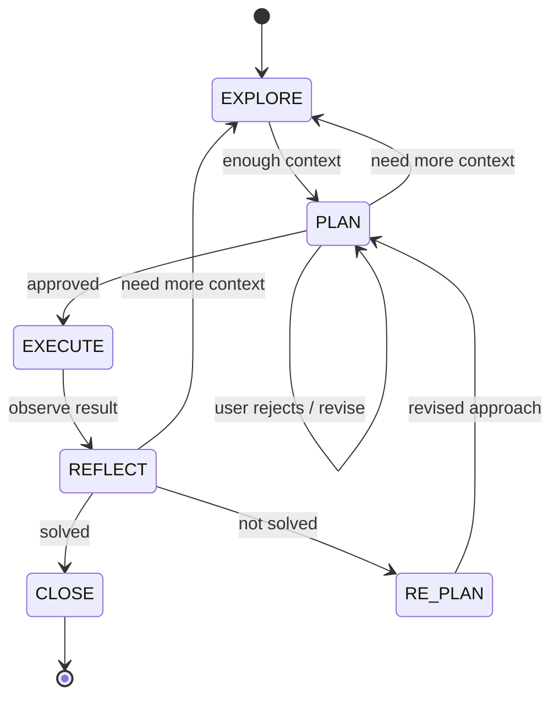

# Iterative Planner

[](LICENSE)
[](CHANGELOG.md)
[](https://www.electiconsulting.com)

**Stop watching Claude go off the rails on complex tasks.**

AI coding agents fail in predictable ways. They plan once, execute linearly, and when something breaks, they pile on fixes until the codebase is buried under wrappers, adapters, and "temporary" workarounds. By the time context rot kicks in, they've forgotten what they were even trying to do.

Iterative Planner is a Claude Code skill that replaces this pattern with a disciplined cycle: **Explore, Plan, Execute, Reflect, Re-plan.** It uses the filesystem as persistent working memory -- so when the context window inevitably fills up, nothing is lost. Every decision, every failed approach, every discovery is written to disk and available for recovery -- not just within a single plan, but across plans.

---

## Quick Start

**Option 1 -- Zip package (recommended)**
Download the zip from [Releases](https://github.com/NikolasMarkou/iterative-planner/releases) and unzip into your local skills directory:
```bash
unzip iterative-planner-v*.zip -d ~/.claude/skills/
```

**Option 2 -- Single file**
Download `iterative-planner-combined.md` from [Releases](https://github.com/NikolasMarkou/iterative-planner/releases) and paste it into Claude's Custom Instructions.
> Note: The single-file version does not include `bootstrap.mjs`. Plan directories must be created manually. For full bootstrap support, use the zip package.

Then give Claude a complex task, or just say: **"plan this"**

---

## How It Works

The skill is a six-state machine. Every transition is logged. Every decision is recorded. The filesystem is the source of truth -- not the context window.



| State | What happens | Boundaries |
|-------|-------------|------------|
| **EXPLORE** | Read code, search, ask questions, map the problem. Read consolidated findings/decisions from previous plans. | Read-only on project files. All notes go to the plan directory. |
| **PLAN** | Design the approach. List every file to touch. Set success criteria. | No code changes. User must approve before execution begins. |
| **EXECUTE** | Implement one step at a time. Commit after each success. | 2 fix attempts max per step. Revert-first on failure. Surprise discoveries → REFLECT. |
| **REFLECT** | Compare results against written criteria. Check if findings still hold. | Evidence-based. Contradicted findings → back to EXPLORE. |
| **RE-PLAN** | Pivot based on what was learned. Correct wrong findings. Log the decision. | Must explain what failed and why. User approves new direction. |
| **CLOSE** | Write summary. Audit decision anchors. Merge findings and decisions to consolidated files. | Verify no leftover debug code or orphaned imports. |

---

## What Makes This Different

### Persistent Memory That Survives Context Rot

Everything important is written to a `plans/` directory on disk. When the context window fills up and earlier messages are compressed or lost, the agent re-reads its own notes. State, decisions, findings, progress -- all on disk, all recoverable, even across sessions.

```
plans/
├── .current_plan               # → active plan directory name
├── FINDINGS.md                 # Consolidated findings across all plans (newest first)
├── DECISIONS.md                # Consolidated decisions across all plans (newest first)
└── plan_2026-02-14_a3f1b2c9/
    ├── state.md                # Where am I? What step? What iteration?
    ├── plan.md                 # The living plan (rewritten each iteration)
    ├── decisions.md            # Append-only log of every decision and pivot
    ├── findings.md             # Index of discoveries (corrected when wrong)
    ├── findings/               # Detailed research files (subagents write here)
    ├── progress.md             # Done vs remaining
    ├── checkpoints/            # Snapshots before risky changes
    └── summary.md              # Written at close
```

### Cross-Plan Knowledge Transfer

When a plan is closed, its findings and decisions are merged into consolidated files at the `plans/` root -- `FINDINGS.md` and `DECISIONS.md`. The most recently closed plan appears first, so the freshest context is immediately accessible without reading the entire file.

When a new plan starts, the agent reads these consolidated files during EXPLORE to learn what was discovered and decided in previous plans. Per-plan files are seeded with a cross-plan context reference. This means:

- A migration plan can build on the codebase analysis from a previous debugging plan
- Failed approaches are visible to future plans -- no repeating the same mistakes
- Findings that were corrected in one plan carry their corrections forward

```markdown
# Consolidated Findings
*Cross-plan findings archive. Entries merged from per-plan findings.md on close. Newest first.*

## plan_2026-02-20_b4e2c3d0
### Index
- [Database Schema](plan_2026-02-20_b4e2c3d0/findings/db-schema.md) — table relationships
### Key Constraints
- Foreign key constraints prevent cascade delete on users table

## plan_2026-02-19_a3f1b2c9
### Index
- [Auth System](plan_2026-02-19_a3f1b2c9/findings/auth-system.md) — entry points, session stores
### Key Constraints
- SessionSerializer shared between cookie middleware AND API auth
```

### Structured Findings That Accumulate and Self-Correct

Most AI agents treat research as throwaway context -- they read files, form impressions, and start coding. When the context window compresses those early reads, the impressions vanish too.

Iterative Planner makes research a first-class artifact. During EXPLORE, every discovery is written to a `findings.md` index and detailed `findings/` files with **file paths, line numbers, and execution flow traces**. The agent cannot even transition to PLAN until it has at least 3 indexed findings covering problem scope, affected files, and existing patterns.

When execution reveals that an earlier finding was wrong, it gets a `[CORRECTED iter-N]` marker -- the original stays for traceability, but the correction is what the agent acts on. Subagents contribute in parallel by writing to `findings/{topic-slug}.md` without collisions.

### The Autonomy Leash

When a plan step fails, the agent gets exactly **2 small fix attempts** -- each constrained to reverting, deleting, or a one-line change. If neither works, it **stops completely** and presents the situation to you. No silent rewrites. No runaway fix chains. You stay in control of every pivot.

### Revert-First Complexity Control

The default response to failure is to simplify, never to add. When something breaks:

1. Can I fix by **reverting**? Do that.
2. Can I fix by **deleting**? Do that.
3. **One-line** fix? Do that.
4. None of the above? **Stop.** Enter REFLECT.

Additional guardrails:
- **10-Line Rule** -- if a "fix" needs more than 10 new lines, it is not a fix. It needs to go through PLAN.
- **3-Strike Rule** -- same area breaks 3 times? The approach is wrong. Mandatory RE-PLAN with a fundamentally different strategy.
- **Complexity Budget** -- every plan tracks files added (max 3), new abstractions (max 2), and net line count (target: net-zero or negative).
- **Nuclear Option** -- at iteration 5, if scope has doubled, recommend full revert. The decision log preserves everything learned for a clean restart.

### Decision Anchoring

When code survives failed alternatives, the agent leaves a `# DECISION D-NNN` comment at the point of impact -- documenting what *not* to do and why. This prevents the next session (or the next developer) from blindly "fixing" a deliberate choice back into a known-broken state.

```python
# DECISION D-003: Using stateless tokens instead of dual-write.
# Dual-write doubled Redis memory due to 30-day TTLs (see decisions.md D-002, D-003).
# Do NOT switch back to session-store-based approach without addressing memory growth.
def create_token(user):
    ...
```

### Clean Code Hygiene

Every file change is tracked in a change manifest. Failed steps are reverted immediately -- no half-applied changes, no commented-out experiments, no orphaned imports. The codebase is always in a known-good state before any new plan begins.

---

## When to Use This

- Multi-file changes (3+ files)
- Migrations and refactors
- Tasks that have already failed once
- Cross-system work (2+ systems)
- Problems with no obvious single solution
- Debugging sessions where the root cause is unclear

Trigger phrases: *"plan this"*, *"figure out"*, *"help me think through"*, *"I've been struggling with"*, *"debug this complex issue"*

## When NOT to Use This

- Single-file, obvious fixes
- Tasks with a well-known, straightforward solution
- Quick bug fixes where you already know the root cause
- When you just want to say "do it"

---

## Bootstrapping

Manage plan directories from your project root:

```bash
node <skill-path>/scripts/bootstrap.mjs new "goal"           # Create new plan
node <skill-path>/scripts/bootstrap.mjs new --force "goal"   # Close active plan, create new one
node <skill-path>/scripts/bootstrap.mjs resume               # Output current plan state for re-entry
node <skill-path>/scripts/bootstrap.mjs status               # One-line state summary
node <skill-path>/scripts/bootstrap.mjs close                # Close active plan (merges + preserves)
node <skill-path>/scripts/bootstrap.mjs list                 # Show all plan directories
```

**`new`** creates the plan directory under `plans/`, writes the pointer file (`plans/.current_plan`), creates consolidated files (`plans/FINDINGS.md`, `plans/DECISIONS.md`) if they don't exist, and drops the agent into EXPLORE. Refuses if an active plan already exists -- use `resume` to continue, `close` to end it, or `new --force` to close and start fresh.

**`close`** merges per-plan findings and decisions into the consolidated files (newest first), removes the pointer file, and preserves the plan directory for reference. This is an administrative operation -- the protocol CLOSE state (writing `summary.md`, auditing decision anchors) should be completed by the agent before running `close`.

**`resume`** outputs the current plan state (state, iteration, step, goal, progress, checkpoints, consolidated file paths) for quick re-entry. **`status`** prints a single-line summary. **`list`** shows all plan directories under `plans/` (active and closed) with their state and goal.

### Git Integration

| Phase | Git behavior |
|-------|-------------|
| EXPLORE, PLAN, REFLECT, RE-PLAN | No commits. |
| EXECUTE (success) | Commit after each step: `[iter-N/step-M] description` |
| EXECUTE (failure) | Revert all uncommitted changes to last clean commit. |
| RE-PLAN | Decide: keep successful commits or revert to checkpoint. |
| CLOSE | Final commit with summary. |

Bootstrap automatically adds `plans/` to `.gitignore` -- preventing plan files from being committed during EXECUTE step commits. Remove this pattern if your team wants decision logs for post-mortems.

---

## Build and Package

```bash
# Windows (PowerShell)
.\build.ps1 package          # Create zip package
.\build.ps1 package-combined # Create single-file skill
.\build.ps1 validate         # Validate structure
.\build.ps1 test             # Run tests (lint + round-trip)
.\build.ps1 clean            # Clean build artifacts

# Unix / Linux / macOS
make package                 # Create zip package
make package-combined        # Create single-file skill
make validate                # Validate structure
make test                    # Run tests (lint + round-trip)
make clean                   # Clean build artifacts
```

---

## Project Structure

```
iterative-planner/
├── README.md                 # This file
├── CLAUDE.md                 # AI assistant guidance for contributing
├── CHANGELOG.md              # Version history
├── LICENSE                   # GNU GPLv3
├── VERSION                   # Single source of truth for version number
├── Makefile                  # Unix/Linux/macOS build
├── build.ps1                 # Windows PowerShell build
└── src/
    ├── SKILL.md              # Core protocol -- the complete skill specification
    ├── scripts/
    │   └── bootstrap.mjs     # Plan directory initializer (Node.js 18+)
    └── references/
        ├── complexity-control.md   # Anti-complexity protocol and forbidden patterns
        ├── code-hygiene.md         # Change manifests, revert procedures, cleanup rules
        ├── decision-anchoring.md   # When and how to anchor decisions in code
        └── file-formats.md         # Templates for every plan directory file
```

---

## Sponsored by

This project is sponsored by **[Electi Consulting](https://www.electiconsulting.com)** -- a technology consultancy specializing in AI, blockchain, cryptography, and data science. Founded in 2017 and headquartered in Limassol, Cyprus, with a London presence, Electi combines academic rigor with enterprise-grade delivery across clients including the European Central Bank, US Navy, and Cyprus Securities and Exchange Commission.

---

## License

[GNU General Public License v3.0](LICENSE)
