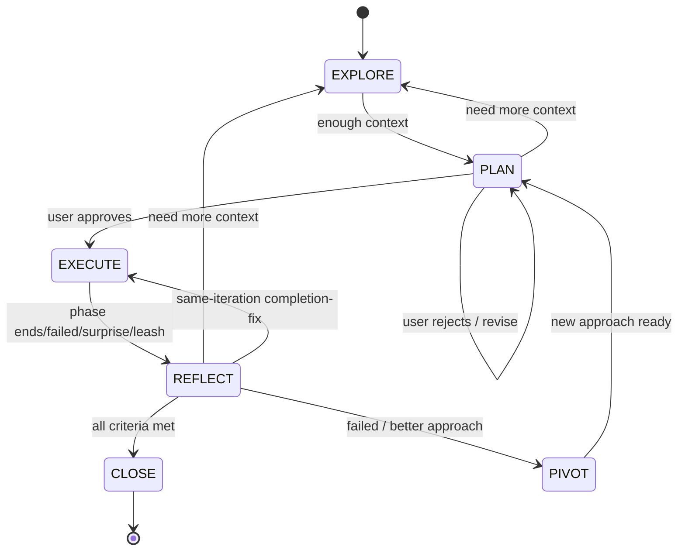

# Iterative Planner

[](LICENSE)
[](CHANGELOG.md)
[](src/scripts/bootstrap.test.mjs)
[](https://www.electiconsulting.com)

**A [Claude Code](https://docs.anthropic.com/en/docs/claude-code) skill that stops an agent from losing the plot halfway through a hard task.**

Turn an agent loose on something big and a familiar failure shows up. It plans once, starts strong, then hits a wall. It patches the wall. The patch breaks something else, so it patches that. A few turns later it has forgotten which fixes it already tried, the codebase is a thicket of half-reverted experiments, and nobody — human or model — can say what state anything is in.

The root cause is not intelligence. It is memory. **The context window is RAM: fast, volatile, and it rots mid-task.** Push enough tokens through it and the early decisions blur, the failed approaches fade, and the agent starts relitigating settled ground.

Iterative Planner gives the agent a disk. Every finding, decision, pivot, and dead end is written to the filesystem the moment it happens — structured, indexed, and re-read on a schedule. The work is driven by a six-state machine: **Explore → Plan → Execute → Reflect → Pivot → Close**. The context window can forget. The plan directory does not.

> The context window is RAM. The filesystem is disk. Truth lives on disk.

And here is the part that sneaks up on you. Those files are not just scratch space for one task — they are a record the *next* task inherits. Every plan leaves behind findings, decisions, hard-won lessons, and a living map of the system it worked on. So the agent stops starting cold. It begins each new job already knowing the terrain, and that knowledge compounds: the tenth plan is sharper than the first because it stands on the nine before it. This tool is least impressive on day one and most valuable on day thirty — it quietly gets better at *your* codebase the more you use it.

Use it for refactors, migrations, debugging, system design, or deep research — anything where "just do it" quietly turns into a mess.

---

## Table of Contents

**Start here**
- [When to Use This](#when-to-use-this)
- [How It Works](#how-it-works)
- [Get Started in 60 Seconds](#get-started-in-60-seconds)
- [A Worked Example](#a-worked-example)
- [Why This Works](#why-this-works)

**Reference**
- [The Plan Directory](#the-plan-directory)
- [Bootstrapping](#bootstrapping)
- [Sub-Agent Architecture](#sub-agent-architecture)
- [Presentation Contracts](#presentation-contracts)
- [Validator](#validator)
- [Git Integration](#git-integration)
- [FAQ](#faq)

**Project**
- [Contributing](#contributing)
- [Project Structure](#project-structure)
- [Sponsored by](#sponsored-by)
- [License](#license)

---

## When to Use This

Reach for it when the task is big enough that "what did I already try?" is a question you expect to ask. Skip it when the answer is already in front of you.

| Use it | Skip it |
|--------|---------|
| Multi-step tasks touching 3+ files or 2+ systems | Single-file, single-step changes |
| Migrations, refactors, architectural changes | Well-known, straightforward solutions |
| Tasks that have already failed once | Quick fixes where you already know the answer |
| Complex research or analysis with many moving parts | One-shot questions |
| System design and technical decision-making | |
| Debugging where the root cause is unclear | |
| Anything where you'd benefit from "what did I already try?" | |

**Trigger phrases**: *"plan this"*, *"figure out"*, *"help me think through"*, *"I've been struggling with"*, *"debug this complex issue"*.

---

## How It Works

Six states, one loop. Every transition is logged, every decision recorded, and the filesystem — not the conversation — is the source of truth.


```mermaid
stateDiagram-v2
    [*] --> EXPLORE
    EXPLORE --> PLAN : enough context
    PLAN --> EXPLORE : need more context
    PLAN --> PLAN : user rejects / revise
    PLAN --> EXECUTE : user approves
    EXECUTE --> REFLECT : phase ends/failed/surprise/leash
    REFLECT --> CLOSE : all criteria met
    REFLECT --> PIVOT : failed / better approach
    REFLECT --> EXPLORE : need more context
    REFLECT --> EXECUTE : same-iteration completion-fix
    PIVOT --> PLAN : new approach ready
    CLOSE --> [*]
```

<details>
<summary><strong>No mermaid renderer? The same six states as a table</strong></summary>

| State | What happens | Guardrails |
|-------|-------------|------------|
| **EXPLORE** | Read, search, ask. Pull cross-plan findings, decisions, lessons, and the system atlas. | Read-only on the project. All notes go to the plan directory. Minimum 3 indexed findings before PLAN. |
| **PLAN** | Design the approach. Identify every artifact to create or modify. Write success criteria, verification strategy, assumptions, failure modes, and a pre-mortem. | No code changes. User must approve before execution. |
| **EXECUTE** | Implement one step at a time. Commit after each success. Append a per-edit changelog line for every file edited. | 2 fix attempts max. Revert-first on failure. Surprises trigger REFLECT. |
| **REFLECT** | Three phases: Gate-In (read everything), Evaluate (verify, diff review, regression check, scope drift, root cause, run validator), Gate-Out (write results, present to user). | Evidence-based only. Regressions and simplification blockers prevent CLOSE. Contradicted findings trigger EXPLORE. |
| **PIVOT** | Diagnose the failure, hunt for ghost constraints, propose a new direction. | Must explain what failed and why. User approves new direction. |
| **CLOSE** | Write summary. Audit decision anchors. Merge knowledge into consolidated files. Rewrite LESSONS.md and SYSTEM.md. | Verify clean output. No leftover artifacts. |

</details>

**The runaway brake.** Iterations increment on each PLAN → EXECUTE transition. At **iteration 5** the protocol forces a decomposition analysis — carve the goal into 2-3 independent sub-goals that could each be their own plan. At **iteration 6+** it hard-stops. This is the deliberate cure for the "just one more iteration" spiral that quietly destroys plans.

---

## Get Started in 60 Seconds

**Requires**: Node.js 18+ (for the bootstrap and validator scripts). No npm install, no runtime dependencies — the scripts are plain ESM on Node builtins.

### Option 1 — Zip package (recommended)

Download the latest zip from [Releases](https://github.com/NikolasMarkou/iterative-planner/releases) and unzip into your local skills directory:

```bash
unzip iterative-planner-v*.zip -d ~/.claude/skills/
```

### Option 2 — Single-file skill

Download `iterative-planner-combined.md` from [Releases](https://github.com/NikolasMarkou/iterative-planner/releases) and add it to Claude Code's Custom Instructions (Settings → Custom Instructions).

> The single-file version does not include `bootstrap.mjs` or the sub-agent definitions (`src/agents/*.md`) — the combined file runs in SKILL.md's single-thread monolithic-fallback mode. Plan directories must be created manually. For full bootstrap and sub-agent support, use the zip package.

### Option 3 — Clone and install

```bash
git clone https://github.com/NikolasMarkou/iterative-planner.git
cd iterative-planner
make build
cp -r build/iterative-planner ~/.claude/skills/
```

### Sub-agents (optional but recommended)

To enable parallel agent dispatch (explorers in parallel, a dedicated verifier, an adversarial reviewer):

```bash
mkdir -p ~/.claude/agents
cp src/agents/*.md ~/.claude/agents/
```

The skill works without sub-agents — they are an optimization layer, not a requirement.

### First run

In any project directory, give Claude a complex task or just say **"plan this"**. Claude runs `bootstrap.mjs new "<your goal>"`, drops into EXPLORE, and walks the cycle.

---

## A Worked Example

Watch one full cycle, condensed. Nothing here is a mock-up — this is the shape every plan takes.

> **You**: "I want to migrate our auth from session cookies to stateless JWTs. Plan this."

**Claude (EXPLORE)** runs `bootstrap.mjs new "Migrate auth from session cookies to JWT"`, creates `plans/plan-2026-05-07T091743-a3f1b2c9/`, then:

- Reads `plans/FINDINGS.md`, `plans/DECISIONS.md`, `plans/LESSONS.md`, `plans/SYSTEM.md` for cross-plan context.
- Spawns 2-3 `ip-explorer` sub-agents in parallel: one maps the auth surface, one inventories existing JWT usage, one examines the test suite.
- Writes results to `findings/auth-system.md`, `findings/jwt-current.md`, `findings/test-coverage.md`.
- Classifies constraints: **HARD** (existing OAuth providers must keep working), **SOFT** (team prefers `jose` over `jsonwebtoken`), **GHOST** (a 5-year-old comment about Redis cluster topology that no longer applies).

**Claude (PLAN)** writes `plan.md` with:

- **Problem Statement** — expected behavior, invariants, edge cases.
- **Steps** — each annotated `[RISK: low/medium/high]` and `[deps: N,M]`. Riskiest first.
- **Success Criteria** + **Verification Strategy** — every criterion has a test command and a pass condition.
- **Assumptions** — each traced to a finding.
- **Failure Modes** — what if the JWT library is slow, returns garbage, or is down.
- **Pre-Mortem & Falsification Signals** — "STOP IF p99 latency increases more than 20ms."

Claude presents the plan as a **PC-PLAN** block (verbatim — not a paraphrase). You approve or push back. If you push back, Claude revises and re-presents the same contract.

**Claude (EXECUTE)** implements step 1. After each file edit, an entry is appended to `changelog.md` recording timestamp, step, commit, file, op, **blast-radius score**, decision-ref, and reason. After each successful step:

- `plan.md` step marked `[x]`.
- `progress.md` updated.
- `state.md` change manifest extended.
- Commit: `[plan-2026-05-07-a3f1b2c9/iter-1/step-1] add JWT verifier`.

If a step fails: **revert uncommitted**, two fix attempts max, each constrained by the Revert-First and 10-Line rules. Both fail → STOP, present, ask you.

**Claude (REFLECT)** runs the verifier. The PASS/FAIL table from `verification.md` is rendered **verbatim** in the **PC-REFLECT** block. If it is iteration 2+ (or earlier by orchestrator choice — e.g. an iteration-1 attack-before-release pass ahead of a release/version bump), an `ip-reviewer` sub-agent runs an adversarial review and its concerns are folded in verbatim. Claude recommends close, pivot, or explore (or execute for a same-iteration completion-fix loop). **You** decide.

**Claude (CLOSE)** spawns `ip-archivist` to write `summary.md`, audit `# DECISION plan-2026-05-07T091743-a3f1b2c9/D-NNN` anchors in source, rewrite `plans/LESSONS.md` (≤200 lines), and rewrite the `plans/SYSTEM.md` atlas (≤300 lines). Then `bootstrap.mjs close` merges per-plan findings and decisions into the consolidated cross-plan files (sliding window of the 4 most recent plans).

The next plan starts with all of this on disk, waiting to be read.

---

## Why This Works

Five ideas separate this from "ask Claude to make a plan."

### 1. Memory that outlives the context window

Everything that matters lives on disk, not in the conversation. State, decisions, findings, progress, and verification results survive restarts, compression, and topic drift. **Mandatory re-reads** keep the agent anchored: `state.md` is re-read every 10 tool calls; after 50 messages, `state.md` and `plan.md` are re-read before every response. The window can rot. The plan directory is the disk that does not.

### 2. It compounds — the more you use it, the smarter it starts

This is the biggest second-order effect, and the easiest to miss. A single plan is a useful artifact. A *history* of plans is something else entirely: an understanding of your system that deepens every time you run one.

When a plan closes, its findings and decisions merge into consolidated files at the `plans/` root, and the next plan reads them during EXPLORE. Migrations build on earlier debugging sessions; design plans inherit constraints found in prior research; failed approaches stay visible so nobody walks into the same wall twice. A **sliding window** keeps the consolidated files to the 4 most recent plans (older sections stay intact in their own directories, indexed by `plans/INDEX.md`).

At the center of this sits the **system atlas** (`plans/SYSTEM.md`): a curated, domain-neutral map of *what the system being planned against actually is* — Identity, Components, Boundaries, Invariants, Flows, Known Patterns. Capped at 300 lines, rewritten at CLOSE, read at the start of every EXPLORE and PLAN. It is why the agent walks into each task already understanding your codebase instead of rediscovering it from scratch — and because the atlas is rewritten at the close of every plan, that understanding gets sharper with use. The curve bends the right way: the work gets easier as the map gets better.

### 3. Research that catches itself lying

Every discovery is written to `findings.md` with file paths, code-path traces, and evidence. The agent cannot advance to PLAN until it holds at least 3 indexed findings covering problem scope, affected areas, and existing patterns. When execution proves a finding wrong, that finding gets a `[CORRECTED iter-N]` marker — the original stays put for traceability. Being wrong is recorded, not erased.

### 4. The autonomy leash

When a step fails during EXECUTE, the agent gets **2 fix attempts**, each constrained to reverting, deleting, or a minimal change. If neither lands, it stops, reverts uncommitted changes, presents what happened, and asks you. No silent third attempt. No "one more try." This single rule is what makes unattended agent work safe to leave running.

### 5. When in doubt, subtract

The default response to failure is to **simplify, never to add**: can I fix this by reverting? By deleting? With a one-line change? If none of those — **stop** and enter REFLECT. Hard limits enforce the instinct.

<details>
<summary><strong>The hard limits that keep complexity from winning</strong></summary>

| Rule | What it does |
|------|-------------|
| **10-Line Rule** | If a "fix" needs more than 10 new lines, it's not a fix. It needs a plan. |
| **3-Strike Rule** | Same area breaks 3 times? The approach is wrong. Mandatory PIVOT, with revert to a covering checkpoint. |
| **Complexity Budget** | Max 3 new files, max 2 new abstractions, target net negative or neutral line count. Tracked in `plan.md`. |
| **Nuclear Option** | At iteration 5, scope doubled? Recommend full revert to the iteration-1 checkpoint. The decision log preserves all learnings. |
| **6 Simplification Checks** | Structured REFLECT diagnostic: delete instead? symptom or root cause? essential or accidental complexity? fighting the framework? worth reverting everything? |

</details>

The rigor is not improvised turn by turn — each state ships with domain-agnostic thinking tools baked in.

<details>
<summary><strong>The reasoning framework wired into each state</strong></summary>

| Framework | State | What it does |
|-----------|-------|-------------|
| **Constraint classification** | EXPLORE | Tag every constraint *hard*, *soft*, or *ghost* (no longer applies). Ghost constraints reveal previously blocked options. |
| **Exploration confidence** | EXPLORE | Self-assess scope, solution space, risk visibility. "Shallow" on any dimension means keep exploring. |
| **Problem decomposition** | PLAN | Understand the whole, find natural boundaries, minimize dependencies, start with the riskiest part. |
| **Assumption tracking** | PLAN | Every assumption traced to a finding and linked to dependent steps. When one breaks, you know what's invalidated. |
| **Pre-mortem & falsification** | PLAN | Assume the plan failed. Why? Extract concrete STOP IF triggers. Counters confirmation bias. |
| **Prediction accuracy** | REFLECT | Compare predicted vs actual step/file/line counts. Calibrates future estimates via LESSONS.md. |
| **Root cause analysis** | REFLECT | On failure: immediate cause, contributing factor, failed defense, prevention. Stop rule against premature closure. |
| **Essential vs accidental complexity** | REFLECT | "Inherent in the problem, or did we create it?" Essential = partition. Accidental = remove. |
| **Ghost-constraint hunting** | PIVOT | Before pivoting, check whether the constraint behind the failed approach is still valid. |

</details>

And three mechanisms keep the workspace honest, all of them auditable on disk.

<details>
<summary><strong>The three honesty mechanisms</strong></summary>

- **Decision anchoring** — when code survives a failed alternative, the agent leaves a plan-qualified `# DECISION <plan-id>/D-NNN` comment at the point of impact, stating what *not* to do and why. The plan-id prefix stays resolvable even after the consolidated `plans/DECISIONS.md` sliding-window trim. The validator audits every anchor at CLOSE. (Details: [`src/references/decision-anchoring.md`](src/references/decision-anchoring.md).)
- **Per-edit changelog + blast-radius scoring** — every file edit appends one line to `{plan-dir}/changelog.md` (timestamp, iter/step, commit, path, op, blast-radius tier, decision-ref, reason). A deterministic scorer tiers each edit LOW/MED/HIGH and surfaces "tiny edit, big radius" outliers that plan-level failure modes miss. Always advisory, never blocks CLOSE. (Details: [`src/references/blast-radius.md`](src/references/blast-radius.md).)
- **Clean output hygiene** — every change is tracked in a manifest, failed steps revert immediately, and forbidden leftovers (TODOs, debug prints, commented-out code, orphan helpers) are flagged at REFLECT. The workspace is always known-good before new work begins.

</details>

---

## The Plan Directory

Everything the agent knows about a task lives in one directory. Peek inside and you can reconstruct the entire train of thought.

```
plans/
├── .current_plan                  # active plan directory name
├── FINDINGS.md                    # consolidated findings, newest first, sliding window of 4 plans
├── DECISIONS.md                   # consolidated decisions, newest first, sliding window of 4 plans
├── LESSONS.md                     # cross-plan institutional memory (max 200 lines, rewritten on close)
├── SYSTEM.md                      # system atlas, domain-neutral map (max 300 lines, rewritten on close)
├── INDEX.md                       # topic-to-directory mapping (survives sliding-window trim)
└── plan-2026-05-07T091743-a3f1b2c9/
    ├── state.md                   # current state, iteration, step, change manifest, transition log
    ├── plan.md                    # the living plan (rewritten each iteration)
    ├── decisions.md               # append-only log of every decision and pivot
    ├── findings.md                # index of discoveries (corrected when wrong)
    ├── findings/                  # detailed research files (one per topic)
    ├── progress.md                # done vs in-progress vs remaining
    ├── verification.md            # verification results per REFLECT cycle
    ├── changelog.md               # per-edit ledger (one line per file edit)
    ├── checkpoints/               # snapshots before risky changes
    ├── lessons_snapshot.md        # LESSONS.md snapshot at close (auto-created)
    └── summary.md                 # written at close
```

**Directory naming** — a plan directory is `plan-YYYY-MM-DDTHHMMSS-XXXXXXXX` (UTC timestamp, colon-free so it is legal on Windows, plus an 8-char hex tail). Directories created before v2.36.0 use the legacy shape `plan_YYYY-MM-DD_XXXXXXXX`; that shape is **never generated again but is always still read** — the pointer, `retire`, the `# DECISION` anchor scan, the consolidated-file sections, and the sliding-window trim all accept both grammars, so old plans and the anchors they left in your source keep resolving.

Templates for every file are in [`src/references/file-formats.md`](src/references/file-formats.md). Each file also has a **lifecycle** — which states write it, which read it, which never touch it — and the protocol enforces a **read-before-write** rule on every plan file: the writing agent must read first, even on the first update after bootstrap.

### File ownership

One rule keeps parallel sub-agents from colliding: **each file has a single owner.** Only the owner writes; everyone else reads. Co-ownership is allowed only where writes are disjoint and never concurrent (the orchestrator sequences the writers), and each co-owner's scope is named explicitly.

<details>
<summary><strong>Peek under the hood: who owns which file</strong></summary>

Usually the orchestrator is the non-authoring co-writer, confined to Post-Step Gate cursor/ledger updates. `decisions.md` inverts this — the Orchestrator and Plan-writer author the entries, while the Executor writes into entries it did not author (back-filling `Anchor-Refs`, recording DRY exceptions) inside its own step's commit.

| File | Owner (Writes) | Readers |
|------|----------------|---------|
| `state.md` | Orchestrator | All agents |
| `plan.md` | Plan-writer (full rewrite) + Orchestrator (Post-Step Gate: step checkbox, marker, complexity budget) | Executor, Verifier, Reviewer |
| `decisions.md` | Orchestrator + Plan-writer (author entries) + Executor (back-fills `Anchor-Refs` on anchored entries, records DRY exceptions) + Archivist (CLOSE-time Anchor-Refs backfill remediation, ip-archivist.md Step 1) | All agents |
| `findings.md` (index) | Orchestrator | Plan-writer, Reviewer |
| `findings/{topic}.md` | Explorer (one per file; orchestrator may delete an empty stale copy before a re-spawn) | Orchestrator, Plan-writer |
| `findings/review-iter-N[-passM].md` | Reviewer | Orchestrator |
| `progress.md` | Orchestrator (Post-Step Gate) | All agents |
| `verification.md` | Plan-writer (template) + Orchestrator (merges Verifier's returned results) | Orchestrator, Reviewer |
| `changelog.md` | Executor (append per edit) + Orchestrator (Post-Step Gate: confirm one line per edited file) | Orchestrator (REFLECT Gate-In), Reviewer (REFLECT scan) |
| `checkpoints/*` | Executor | Orchestrator (for PIVOT + EXECUTE leash-hit) |
| `summary.md` | Archivist | — |
| `plans/FINDINGS.md` | Archivist (via bootstrap) | Orchestrator, Plan-writer |
| `plans/DECISIONS.md` | Archivist (via bootstrap) | Orchestrator, Plan-writer |
| `plans/LESSONS.md` | Archivist | Orchestrator, Explorer, Plan-writer |
| `plans/SYSTEM.md` | Archivist | Orchestrator, Plan-writer, Explorer |
| `plans/INDEX.md` | Archivist (via bootstrap) | Orchestrator |

</details>

---

## Bootstrapping

A single Node script manages every plan directory from your project root. You rarely type these by hand — Claude runs them for you — but they are the whole lifecycle, and worth knowing.

The command you will reach for most is **`resume`**: at the start of a new conversation, after compression, or any time the agent seems to have lost track, it reconstructs the current state from disk and prints a structured re-entry summary. The agent never starts over — it picks up from `state.md`.

<details>
<summary><strong>The full bootstrap CLI</strong></summary>

```bash
node <skill-path>/scripts/bootstrap.mjs new "goal"           # create new plan
node <skill-path>/scripts/bootstrap.mjs new --force "goal"   # close active plan, create new one
node <skill-path>/scripts/bootstrap.mjs resume               # output current plan state for re-entry
node <skill-path>/scripts/bootstrap.mjs status               # one-line state summary
node <skill-path>/scripts/bootstrap.mjs close                # close active plan (merges + preserves)
node <skill-path>/scripts/bootstrap.mjs list                 # show all plan directories
node <skill-path>/scripts/bootstrap.mjs banner               # print version + credit banner (no active plan needed)
node <skill-path>/scripts/bootstrap.mjs retire <plan-id>     # mark a removed plan's DECISION anchors [STALE], drop its dir
node <skill-path>/scripts/bootstrap.mjs reset-attempts       # clear active plan's Fix Attempts (unjam stale leash counter)
node <skill-path>/scripts/validate-plan.mjs                  # validate active plan compliance
```

- **`new`** creates the plan directory, writes the `.current_plan` pointer, ensures cross-plan files exist (`FINDINGS.md`, `DECISIONS.md`, `LESSONS.md`, `SYSTEM.md`, `INDEX.md`), adds `plans/` to `.gitignore`, and drops the agent into EXPLORE. Refuses if an active plan already exists — use `resume` to continue, `close` to end it, or `new --force` to close-and-replace. The bare form `node bootstrap.mjs "goal"` is a backward-compatible alias for `new "goal"`.
- **`close`** merges per-plan findings and decisions into the consolidated files (newest first), appends to `INDEX.md`, snapshots `LESSONS.md` to the plan directory, removes the pointer, and preserves the plan directory for reference.
- **`resume`** reads `state.md`, `plan.md`, `progress.md`, and `decisions.md` and prints the re-entry summary. **`status`** prints a one-line summary; **`list`** shows all plan directories with state and goal.

</details>

<details>
<summary><strong>What close does when it merges — the edge cases</strong></summary>

When `close` merges per-plan files into `plans/FINDINGS.md` and `plans/DECISIONS.md`: only content at and below the first `##` heading is merged; per-plan files with no `##` headings are skipped as boilerplate; cross-plan boilerplate notes are stripped to avoid duplication; relative links like `(findings/foo.md)` are rewritten to include the plan directory path.

</details>

---

## Sub-Agent Architecture

The orchestrator coordinates seven specialized agents. Sub-agents cannot spawn other sub-agents — the orchestrator is the sole coordinator. And the whole layer is **optional**: if the agent definitions are not installed under `~/.claude/agents/`, the monolithic skill drives the same state machine in a single thread.

When the skill activates with the definitions present, the conversation assumes the orchestrator role **in-thread** — it reads `agents/ip-orchestrator.md` and adopts it, rather than spawning a separate orchestrator. See [`src/SKILL.md`](src/SKILL.md) "Orchestrator Role Assumption."

<details>
<summary><strong>The seven agents: roles, tools, models</strong></summary>

| Agent | Role | Tools | Model |
|-------|------|-------|-------|
| **Orchestrator** | State machine owner, dispatcher, user-facing relay | Agent, Read, Write, Edit, Bash, Grep, Glob | inherit |
| **ip-explorer** | Read-only codebase research (EXPLORE) | Read, Write, Grep, Glob, Bash | sonnet |
| **ip-plan-writer** | Generates `plan.md` and the `verification.md` template (PLAN) | Read, Write, Edit, Grep, Glob | inherit |
| **ip-executor** | Implements one plan step at a time (EXECUTE) | Read, Edit, Write, Bash, Grep, Glob | inherit |
| **ip-verifier** | Runs verification checks, returns results for the Orchestrator to merge into `verification.md` (REFLECT) | Read, Bash, Grep, Glob | sonnet |
| **ip-reviewer** | Adversarial review, iteration ≥ 2 by default; earlier by orchestrator choice, e.g. an iteration-1 attack-before-release pass (REFLECT) | Read, Write, Grep, Glob, Bash | opus |
| **ip-archivist** | CLOSE housekeeping: `summary.md`, anchor audit, LESSONS, SYSTEM | Read, Write, Edit, Grep, Glob, Bash | sonnet |

**Dispatch by state**: EXPLORE — 1-3 explorers in parallel, one per topic. PLAN — one plan-writer. EXECUTE — one executor per step, sequential (exactly one executor at a time — plan steps are sequential, so executor file conflicts cannot arise). REFLECT — verifier(s) for checks, reviewer (iteration 2+ by default, or earlier by orchestrator choice — e.g. an iteration-1 attack-before-release pass) for adversarial review. CLOSE — archivist for the housekeeping.

</details>

---

## Presentation Contracts

Sub-agents are invisible to you — only the orchestrator's chat text reaches you, and disk artifacts are memory, not a user-facing channel. Left to its own devices, an orchestrator will collapse a critical artifact (the verifier's PASS/FAIL table, the reviewer's concerns, a leash-failure block) into a terse summary and quietly drop the detail you needed. **Presentation Contracts** forbid that: every user-facing transition is governed by a named contract that fixes when it fires, the ordered content, the fidelity (verbatim vs digest), and the minimum sections it must include.

<details>
<summary><strong>The six contracts and what each guarantees</strong></summary>

| Contract | When | Floor |
|----------|------|-------|
| **PC-EXPLORE** | EXPLORE handoff to PLAN | Findings index, key constraints (HARD/SOFT/GHOST), exploration confidence, synthesis paragraph |
| **PC-PLAN** | Before user approval to EXECUTE | `plan.md` rendered verbatim — Steps, Success Criteria, Verification Strategy, Failure Modes, Assumptions |
| **PC-EXECUTE-STEP** | After each successful step | 5 fields: step, files, commit, surprises, next-preview |
| **PC-EXECUTE-LEASH** | On autonomy leash hit | 5 fields: step intent, 2 attempts, root cause guess, checkpoint registry, prompt |
| **PC-REFLECT** | Phase-3 Gate-Out | Exactly 5 items: completed, remaining, verifier table verbatim, issues + reviewer concerns, recommendation + prompt |
| **PC-PIVOT** | Pivot Options | Pivot reason, checkpoint registry, ghost constraints, 1-3 candidate directions framed "X at the cost of Y", explicit prompt |

</details>

Canonical definitions live in [`src/references/file-formats.md`](src/references/file-formats.md) under "Presentation Contracts." This closes the old gap where the protocol used single verbs ("Present", "Report", "Surface") and the orchestrator defaulted to terse summaries.

---

## Validator

`src/scripts/validate-plan.mjs` is a read-only protocol-compliance check. It runs automatically during REFLECT and can be run by hand any time. Exit 0 = pass, exit 1 = errors; warnings are non-blocking. A separate `--pre-step` mode runs before each EXECUTE step and HARD-blocks (exit 2) on a leash-cap, wrong-state, iteration-cap, or no-plan condition — the mechanism that turns the autonomy leash from advice into enforcement.

<details>
<summary><strong>Everything the validator checks</strong></summary>

State-transition validity; the mandatory `plan.md` sections (Problem Statement, Verification Strategy, Failure Modes, Assumptions, Pre-Mortem); the ≥3-findings gate before PLAN; cross-file consistency (state ↔ plan ↔ progress ↔ verification); the decisions schema (D-NNN sequential, "X at the cost of Y" trade-off, PIVOT complexity assessment); plan-qualified DECISION anchors in source (forward + reverse audit); the `verification.md` verdict structure; convergence metrics (iteration 2+); iteration limits; the SYSTEM.md cap; and the 8-field changelog format.

</details>

The validator cannot inspect chat content — it surfaces metadata signals only. Content fidelity is enforced by the agent prompts themselves.

---

## Git Integration

Commits are the agent's undo history, and the protocol is deliberate about when they happen.

| Phase | Git behavior |
|-------|-------------|
| EXPLORE / PLAN / REFLECT / PIVOT | No commits. |
| EXECUTE (success) | Commit after each step: `[plan-YYYY-MM-DD-HASH/iter-N/step-M] description`. Tag id = the plan-dir name with the `THHMMSS` segment dropped (`plan-2026-07-14T051317-317362c4` → `plan-2026-07-14-317362c4`); a legacy dir derives the same way with `_` normalized to `-`. The changelog's own `step` field stays bare `iter-N/step-M`. |
| EXECUTE (failure) | Revert all uncommitted changes to the last clean commit. |
| PIVOT | Decide: keep successful commits, or `git checkout <checkpoint-commit> -- .` to revert. Choice logged in `decisions.md`. |
| CLOSE | Finalizes **on disk**: writes `summary.md`, audits DECISION anchors, rewrites `plans/LESSONS.md` + `plans/SYSTEM.md`, merges the consolidated cross-plan files, then runs `bootstrap.mjs close`. **No git commit or tag is created** — a summarizing commit/tag at CLOSE is a documented, deferred spec item, not yet implemented (no agent or script issues any git commit/tag). |

Bootstrap automatically adds `plans/` to `.gitignore`. Remove that entry if your team wants decision logs versioned for post-mortems.

---

## FAQ

**What if bootstrap refuses to create a new plan?**
An active plan already exists. Use `resume` to continue it, `close` to end it, or `new --force` to close it and start fresh.

**Can I have multiple active plans at once?**
No. One active plan at a time, tracked by `plans/.current_plan`. Close the current plan before starting a new one.

**Where do plan files go?**
Always under `plans/` in the project root. Bootstrap creates this directory automatically.

**Are plan files committed to git?**
No. Bootstrap adds `plans/` to `.gitignore` by default. Remove it if you want decision logs versioned.

**What if I want to start completely over?**
Run `bootstrap.mjs new --force "new goal"`. This closes the active plan (merging its findings) and creates a fresh one. All previous plan directories are preserved.

**What happens at iteration 5?**
The protocol forces a decomposition analysis: identify 2-3 independent sub-goals that could each be a separate plan. At iteration 6+, execution stops entirely.

**Can I run the agents in parallel?**
Explorers always parallelize. Verifiers can parallelize across independent checks. Executors never parallelize — exactly one runs at a time, because plan steps are sequential. The orchestrator sequences anything that touches the same plan file.

**Do I need the sub-agent definitions?**
No. They are an optimization layer. Without them, the monolithic skill drives the same state machine in a single thread.

**What if I lose context mid-plan?**
Run `bootstrap.mjs resume`. It reconstructs the current state from disk and prints a summary. The agent never starts over — it picks up from `state.md`.

**Why plan-qualified DECISION anchors?**
The consolidated `plans/DECISIONS.md` uses a 4-plan sliding window. Bare `D-NNN` anchors become orphans once their plan is trimmed. Plan-qualified anchors (`# DECISION <plan-id>/D-NNN`) survive the trim and resolve unambiguously.

---

## Contributing

The test suite covers bootstrap operations, state transitions, consolidated file management, sliding-window behavior, anchor validation, and edge cases — 677 tests across 13 suites, all on `node:test` with zero external dependencies.

<details>
<summary><strong>Running the tests (and the per-suite breakdown)</strong></summary>

```bash
node --test src/scripts/bootstrap.test.mjs \
            src/scripts/validate-plan.test.mjs \
            src/scripts/blast-radius.test.mjs \
            src/scripts/check-doc-parity.test.mjs \
            src/scripts/emit-state.test.mjs \
            src/scripts/emit-template.test.mjs \
            src/scripts/check-readme-parity.test.mjs \
            src/scripts/check-changelog-parity.test.mjs \
            src/scripts/check-test-count.test.mjs \
            src/scripts/check-agent-wiring.test.mjs \
            src/scripts/check-template-parity.test.mjs \
            src/scripts/shared.test.mjs \
            src/scripts/schema.test.mjs
# 677 tests total: bootstrap 239, validate-plan 117, shared 71, schema 48,
#                  check-agent-wiring 51, blast-radius 41, check-template-parity 40,
#                  check-test-count 17, check-doc-parity 16, emit-state 12,
#                  emit-template 11, check-changelog-parity 8, check-readme-parity 6
```

`node src/scripts/check-test-count.mjs` re-runs the suite and fails if the live pass count disagrees with the `TEST_COUNT` file. It runs as part of `make test` (not `make validate`, which stays suite-free and fast). The per-suite numbers above are hand-maintained prose — if they drift, `TEST_COUNT` and the badge remain the machine-checked source of truth.

</details>

`VERSION` is the single source of truth for the version number. Both `Makefile` and `build.ps1` read from it. Bump `VERSION` and `CHANGELOG.md`; nothing else.

<details>
<summary><strong>Build and package commands (Make / PowerShell)</strong></summary>

```bash
# Windows (PowerShell)
.\build.ps1 build            # build skill package structure
.\build.ps1 build-combined   # build single-file skill with inlined references
.\build.ps1 package          # create zip package
.\build.ps1 package-combined # single-file skill in dist/
.\build.ps1 package-tar      # tarball package
.\build.ps1 validate         # validate skill structure
.\build.ps1 lint             # check script syntax
.\build.ps1 test             # run tests (lint + round-trip)
.\build.ps1 clean            # remove build artifacts
.\build.ps1 list             # show package contents
.\build.ps1 help             # show available commands

# Unix / Linux / macOS
make build
make build-combined
make package                 # default
make package-combined
make package-tar
make validate
make lint
make test
make clean
make list
make help
```

</details>

<details>
<summary><strong>Validation checklist before submitting changes</strong></summary>

- [ ] `make validate` (or `.\build.ps1 validate`) passes
- [ ] `node --test src/scripts/*.test.mjs` passes (677 tests, 0 failing) and `node src/scripts/check-test-count.mjs` exits 0
- [ ] `src/SKILL.md` has `name:` and `description:` in YAML frontmatter
- [ ] All cross-references in `src/SKILL.md` point to existing files in `src/references/`
- [ ] State machine diagram matches transition rules table
- [ ] Plan directory structure in `src/SKILL.md` matches `bootstrap.mjs` output
- [ ] Agent definitions in `src/agents/` have `name:`, `description:`, `tools:` in YAML frontmatter
- [ ] File Ownership Model table matches agent tool permissions

</details>

---

## Project Structure

<details>
<summary><strong>The full file tree</strong></summary>

```
iterative-planner/
├── README.md                       # this file
├── CLAUDE.md                       # AI assistant guidance for contributors
├── CHANGELOG.md                    # version history
├── LICENSE                         # GNU GPLv3
├── VERSION                         # single source of truth for version number
├── Makefile                        # Unix/Linux/macOS build
├── build.ps1                       # Windows PowerShell build
└── src/
    ├── SKILL.md                    # core protocol — the complete skill specification
    ├── agents/                     # sub-agent definitions (optional, install to ~/.claude/agents/)
    │   ├── ip-orchestrator.md      # state machine owner, spawns all other agents
    │   ├── ip-explorer.md          # read-only codebase research (EXPLORE)
    │   ├── ip-plan-writer.md       # plan generation (PLAN)
    │   ├── ip-executor.md          # code execution (EXECUTE)
    │   ├── ip-verifier.md          # verification checks (REFLECT)
    │   ├── ip-reviewer.md          # adversarial review (REFLECT, iteration ≥ 2 by default; earlier by orchestrator choice)
    │   └── ip-archivist.md         # CLOSE housekeeping
    ├── scripts/
    │   ├── bootstrap.mjs           # plan directory lifecycle (Node.js 18+)
    │   ├── bootstrap.test.mjs      # bootstrap test suite (node:test)
    │   ├── validate-plan.mjs       # protocol compliance validator (+ `--pre-step` gate, exit 2)
    │   ├── validate-plan.test.mjs  # validator test suite
    │   ├── blast-radius.mjs        # deterministic per-file blast-radius scorer (spawnSync argv — no shell)
    │   ├── blast-radius.test.mjs   # blast-radius test suite (node:test)
    │   ├── check-doc-parity.mjs    # README<->SKILL.md File Ownership parity gate: keys + owner-cell text + anti-vacuity key floor (run via make validate)
    │   ├── check-doc-parity.test.mjs # doc-parity test suite (node:test)
    │   ├── check-readme-parity.mjs         # README version badge and test count parity gate (used by make/build.ps1 validate; Node.js 18+)
    │   ├── check-readme-parity.test.mjs    # Test suite (node:test)
    │   ├── check-changelog-parity.mjs      # CHANGELOG.md top-entry version and VERSION file parity gate (run via make validate)
    │   ├── check-changelog-parity.test.mjs # Test suite (node:test)
    │   ├── check-test-count.mjs    # TEST_COUNT vs live `node --test` pass-count gate (run via make test)
    │   ├── check-test-count.test.mjs # check-test-count test suite (node:test)
    │   ├── check-agent-wiring.mjs  # prose-layer gate: script paths, reference citations, section pointers, anti-vacuity scan floor (run via make validate)
    │   ├── check-agent-wiring.test.mjs # agent-wiring test suite (node:test)
    │   ├── check-template-parity.mjs # byte-parity gate: bootstrap.mjs's PLAN_TEMPLATES vs file-formats.md's `<!-- SKELETON:* -->` regions (run via make validate)
    │   ├── check-template-parity.test.mjs # template-parity test suite (node:test)
    │   ├── check-register.mjs      # register-density ratchet gate (run via make validate)
    │   ├── check-register.test.mjs # register test suite (node:test)
    │   ├── schema.mjs              # CHANGELOG_SPEC — the one declarative definition of the changelog's field shapes (used by validate-plan.mjs)
    │   ├── schema.test.mjs         # schema test suite (node:test)
    │   ├── emit-state.mjs          # per-state rule router; emits scripts/modules/state-<s>.md on demand
    │   ├── emit-state.test.mjs     # emit-state test suite (node:test)
    │   ├── emit-template.mjs       # per-template slicer; emits one plan-file template from references/file-formats.md via --name <slug>
    │   ├── emit-template.test.mjs  # emit-template test suite (node:test)
    │   ├── shared.mjs              # shared helpers (field extraction, changelog field split, compression markers, id grammars)
    │   └── modules/                # verbatim per-state rule bodies (EXPLORE/PLAN/EXECUTE/REFLECT/PIVOT), emitted on demand
    └── references/
        ├── blast-radius.md         # tiers, signals, scoring formula for the per-edit ledger
        ├── code-hygiene.md         # change manifests, revert procedures, cleanup rules
        ├── complexity-control.md   # anti-complexity protocol and forbidden patterns
        ├── convergence-metrics.md  # convergence score, momentum tracker, iteration health
        ├── decision-anchoring.md   # when and how to anchor decisions in code (plan-qualified)
        ├── file-formats.md         # templates for every plan directory file + Presentation Contracts
        ├── planning-rigor.md       # assumptions, pre-mortem, falsification, root cause, decomposition
        ├── python-software.md      # Python/software-engineering caveat (conditional)
        └── root-cause-analysis.md  # 5 Whys, fishbone, opt-in fault tree, Cynefin selector (extends planning-rigor.md)
```

</details>

For the complete protocol specification, see [`src/SKILL.md`](src/SKILL.md).

---

## Sponsored by

This project is sponsored by **[Electi Consulting](https://www.electiconsulting.com)**, a technology consultancy specializing in AI, blockchain, cryptography, and data science. Founded in 2017, headquartered in Limassol, Cyprus, with a London presence. Clients include the European Central Bank, US Navy, and Cyprus Securities and Exchange Commission.

---

## License

[GNU General Public License v3.0](LICENSE)
