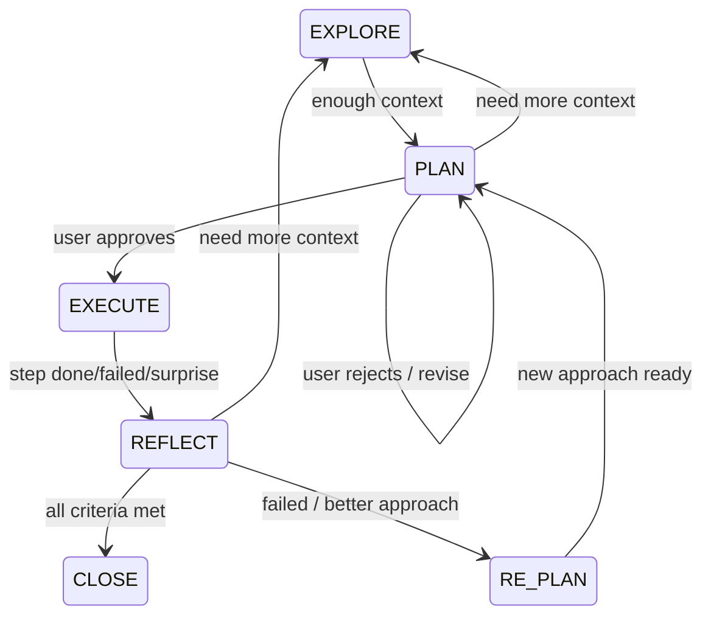

# Iterative Planner

**Core Principle**: Context Window = RAM. Filesystem = Disk.
Write to disk immediately. The context window will rot. The files won't.

**`{plan-dir}`** = `.claude/.plan_YYYY-MM-DD_XXXXXXXX/` (active plan directory under project root).
**Discovery**: `.claude/.current_plan` contains the plan directory name. One active plan at a time.

## State Machine



| State | Purpose | Allowed Actions |
|-------|---------|-----------------|
| EXPLORE | Gather context | Read-only on project. Write only to `{plan-dir}`. |
| PLAN | Design approach | Write plan.md. NO code changes. |
| EXECUTE | Implement step-by-step | Edit files, run commands, write code. |
| REFLECT | Evaluate results | Read outputs, run tests. Update decisions.md. |
| RE-PLAN | Revise direction | Log pivot in decisions.md. Do NOT write plan.md yet. |
| CLOSE | Finalize | Write summary.md. Audit decision anchors. |

### Transitions

| From → To | Trigger |
|-----------|---------|
| EXPLORE → PLAN | Sufficient context. Findings written. |
| PLAN → EXPLORE | Can't state problem, can't list files, or insufficient findings. |
| PLAN → PLAN | User rejects plan. Revise and re-present. |
| PLAN → EXECUTE | User explicitly approves. |
| EXECUTE → REFLECT | Step completes, fails, surprises, or leash hit. |
| REFLECT → CLOSE | All success criteria met. |
| REFLECT → RE-PLAN | Failure or better approach found. |
| REFLECT → EXPLORE | Need more context before re-planning. |
| RE-PLAN → PLAN | New approach formulated. Decision logged. |

Every transition → log in `state.md`. RE-PLAN transitions → also log in `decisions.md` (what failed, what learned, why new direction).
At CLOSE → audit decision anchors (`references/decision-anchoring.md`).

### Mandatory Re-reads (CRITICAL)

These files are active working memory. Re-read during the conversation, not just at start.

| When | Read | Why |
|------|------|-----|
| Before any EXECUTE step | `state.md`, `plan.md`, `progress.md` | Confirm step, manifest, fix attempts, progress sync |
| Before writing a fix | `decisions.md` | Don't repeat failed approaches. Check 3-strike. |
| Before modifying `DECISION`-commented code | Referenced `decisions.md` entry | Understand why before changing |
| Before PLAN or RE-PLAN | `decisions.md`, `findings.md`, `findings/*` | Ground plan in known facts |
| Before any REFLECT | `plan.md` (criteria), `progress.md` | Compare against written criteria, not vibes |
| Every 10 tool calls | `state.md` | Reorient. Right step? Scope crept? |

**>50 messages**: re-read `state.md` + `plan.md` before every response. Files are truth, not memory.

## Bootstrapping

```bash
node <skill-path>/scripts/bootstrap.mjs "goal"              # Create new plan (backward-compatible)
node <skill-path>/scripts/bootstrap.mjs new "goal"           # Create new plan
node <skill-path>/scripts/bootstrap.mjs new --force "goal"   # Close active plan, create new one
node <skill-path>/scripts/bootstrap.mjs resume               # Re-entry summary for new sessions
node <skill-path>/scripts/bootstrap.mjs status               # One-line state summary
node <skill-path>/scripts/bootstrap.mjs close                # Close plan (preserves directory)
```

`new` refuses if active plan exists — use `resume`, `close`, or `--force`.
`new` ensures `.gitignore` includes `.claude/.plan_*` and `.claude/.current_plan` — prevents plan files from being committed during EXECUTE step commits.
After bootstrap → begin EXPLORE. User-provided context → write to `findings.md` first.

## Filesystem Structure

```
.claude/
├── .current_plan              # → active plan directory name
└── .plan_2026-02-14_a3f1b2c9/ # {plan-dir}
    ├── state.md               # Current state + transition log
    ├── plan.md                # Living plan (rewritten each iteration)
    ├── decisions.md           # Append-only decision/pivot log
    ├── findings.md            # Summary + index of findings
    ├── findings/              # Detailed finding files (subagents write here)
    ├── progress.md            # Done vs remaining
    ├── checkpoints/           # Snapshots before risky changes
    └── summary.md             # Written at CLOSE
```

Templates: `references/file-formats.md`

### File Lifecycle Matrix

R = read, W = write, — = do not touch (wrong state if you are).

| File | EXPLORE | PLAN | EXECUTE | REFLECT | RE-PLAN | CLOSE |
|------|---------|------|---------|---------|---------|-------|
| state.md | W | W | R+W | W | W | W |
| plan.md | — | W | R+W | R | R | R |
| decisions.md | — | R+W | R | R+W | R+W | R |
| findings.md | W | R | — | R | R+W | R |
| findings/* | W | R | — | R | R+W | R |
| progress.md | — | W | R+W | R+W | W | R |
| checkpoints/* | — | — | W | R | R | — |
| summary.md | — | — | — | — | — | W |

## Per-State Rules

### EXPLORE
- Read code, grep, glob, search. One focused question at a time.
- Flush to `findings.md` + `findings/` after every 2 reads.
- Include file paths + code path traces (e.g. `auth.rb:23` → `SessionStore#find` → `redis_store.rb:get`).
- DO NOT skip EXPLORE even if you think you know the answer.
- Use **Task subagents** to parallelize research. All subagent output → `{plan-dir}/findings/` files. Never rely on context-only results. **Main agent** updates `findings.md` index after subagents write — subagents don't touch the index.
- Use "think hard" / "ultrathink" for complex analysis.
- REFLECT → EXPLORE loops: append to existing findings, don't overwrite. Mark corrections with `[CORRECTED iter-N]`.

### PLAN
- **Gate check**: read `findings.md`, `findings/*`, `decisions.md` before writing anything. If not read → read now. No exceptions.
- **Problem Statement first** — before designing steps, write in `plan.md`: (1) what behavior is expected, (2) invariants — what must always be true, (3) edge cases at boundaries. Can't state the problem clearly → go back to EXPLORE.
- Write `plan.md`: problem statement, steps, failure modes, risks, success criteria, complexity budget.
- **Failure Mode Analysis** — for each external dependency or integration point in the plan, answer: what if slow? returns garbage? is down? What's the blast radius? Write to plan.md `Failure Modes` section. No dependencies → write "None identified" (proves you checked).
- Write `decisions.md`: log chosen approach + why (mandatory even for first plan). **Trade-off rule** — phrase every decision as **"X at the cost of Y"**. Never recommend without stating what it costs.
- Write `state.md` + `progress.md`.
- List **every file** to modify/create. Can't list them → go back to EXPLORE.
- Only recommended approach in plan. Alternatives → `decisions.md`.
- Wait for explicit user approval.

### EXECUTE
- Re-read `state.md` + `plan.md` before each step. Re-read `decisions.md` before any fix.
- Iteration 1, first EXECUTE → create `checkpoints/cp-000-iter1.md` (nuclear fallback). "Git State" = commit hash BEFORE changes (the restore point).
- One step at a time. Post-Step Gate after each (see below).
- Checkpoint before risky changes (3+ files, shared modules, destructive ops). Name: `cp-NNN-iterN.md` (e.g. `cp-001-iter2.md`). Increment NNN globally across iterations.
- Commit after each successful step: `[iter-N/step-M] description`.
- If something breaks → STOP. 2 fix attempts max (Autonomy Leash). Each must follow Revert-First.
- **Surprise discovery** (behavior contradicts findings, unknown dependency, wrong assumption) → note in `state.md`, finish or revert current step, transition to REFLECT. Do NOT silently update findings during EXECUTE.
- Add `# DECISION D-NNN` comments where needed (`references/decision-anchoring.md`).

#### Post-Step Gate (MANDATORY — all 3 before moving on)
1. `plan.md` — mark step `[x]`, advance marker, update complexity budget
2. `progress.md` — move item Remaining → Completed, set next In Progress
3. `state.md` — update step number, append to change manifest

### REFLECT
- Read `plan.md` (criteria) + `progress.md` before evaluating.
- Read `findings.md` + relevant `findings/*` — check if discoveries during EXECUTE contradict earlier findings. Note contradictions in `decisions.md`.
- Read `checkpoints/*` — know what rollback options exist before deciding next transition. Note available restore points in `decisions.md` if transitioning to RE-PLAN.
- Cross-validate: every `[x]` in plan.md must be "Completed" in progress.md. Fix drift first.
- Read `decisions.md` — check 3-strike patterns.
- Compare against **written criteria**, not memory. Run 5 Simplification Checks (`references/complexity-control.md`).
- Write `decisions.md` (what happened, learned, root cause) + `progress.md` + `state.md`.

| Condition | → Transition |
|-----------|--------------|
| All criteria met + tests pass | → CLOSE |
| Failure understood, new approach clear | → RE-PLAN |
| Unknowns need investigation, or findings contradicted | → EXPLORE (update findings first) |

### RE-PLAN
- Read `decisions.md`, `findings.md`, relevant `findings/*`.
- Read `checkpoints/*` — decide keep vs revert:
  - **Keep successful commits** when: steps already committed are valid under the new approach. Log: "Keeping steps 1-2, reverting step 3."
  - **Revert to checkpoint** when: new approach is fundamentally different, or kept commits would conflict. Log: "Reverting to cp-NNN. Reason: [why]."
  - **Default**: if unsure, revert to latest checkpoint. Safer than debugging stale state.
- If earlier findings proved wrong or incomplete → update `findings.md` + `findings/*` with corrections. Mark corrections: `[CORRECTED iter-N]` + what changed and why. Append, don't delete original text.
- Write `decisions.md`: log pivot + mandatory Complexity Assessment.
- Write `state.md` + `progress.md` (mark failed items, note pivot).
- Present options to user → get approval → transition to PLAN.

## Complexity Control (CRITICAL)

Default response to failure = simplify, not add. See `references/complexity-control.md`.

**Revert-First** — when something breaks: (1) STOP (2) revert? (3) delete? (4) one-liner? (5) none → REFLECT.
**10-Line Rule** — fix needs >10 new lines → it's not a fix → REFLECT.
**3-Strike Rule** — same area breaks 3× → RE-PLAN with fundamentally different approach. Revert to checkpoint covering the struck area.
**Complexity Budget** — tracked in plan.md: files added 0/3, abstractions 0/2, lines net-zero target.
**Forbidden**: wrapper cascades, config toggles, copy-paste, exception swallowing, type escapes, adapters, "temporary" workarounds.
**Nuclear Option** — iteration 5 + bloat >2× scope → recommend full revert to `cp-000` (or later checkpoint if user agrees).

## Autonomy Leash (CRITICAL)

When a step fails during EXECUTE:
1. **2 fix attempts max** — each must follow Revert-First + 10-Line Rule.
2. Both fail → **STOP COMPLETELY.** No 3rd fix. No silent alternative. No skipping ahead.
3. Revert uncommitted changes to last clean commit. Codebase must be known-good before presenting.
4. Present: what step should do, what happened, 2 attempts, root cause guess, available checkpoints for rollback.
5. Transition → REFLECT. Log leash hit in `state.md`. Wait for user.

Track attempts in `state.md`. Resets on: user direction, new step, or RE-PLAN.
**No exceptions.** Unguided fix chains derail projects.

## Code Hygiene (CRITICAL)

Failed code must not survive. Track changes in **change manifest** in `state.md`.
Failed step → revert all uncommitted. RE-PLAN → explicitly decide keep vs revert.
Codebase must be known-good before any PLAN. See `references/code-hygiene.md`.

## Decision Anchoring (CRITICAL)

Code from failed iterations carries invisible context. Anchor `# DECISION D-NNN`
at point of impact — state what NOT to do and why. Audit at CLOSE.
See `references/decision-anchoring.md`.

## Iteration Limits

Increment on PLAN → EXECUTE. Iteration 0 = EXPLORE-only (pre-plan). First real = iteration 1.
If iteration > 5 → STOP: going in circles? harder than scoped? break into smaller tasks?

## Recovery from Context Loss

1. `.claude/.current_plan` → plan dir name
2. `state.md` → where you are
3. `plan.md` → current plan
4. `decisions.md` → what was tried / failed
5. `progress.md` → done vs remaining
6. `findings.md` + `findings/*` → discovered context
7. `checkpoints/*` → available rollback points and their git hashes
8. Resume from current state. Never start over.

## Git Integration

- EXPLORE/PLAN/REFLECT/RE-PLAN: no commits.
- EXECUTE: commit per successful step `[iter-N/step-M] desc`. Failed step → revert uncommitted.
- RE-PLAN: keep successful commits if valid under new plan, or `git checkout <checkpoint-commit> -- .` to revert. No partial state. Log choice in `decisions.md`.
- CLOSE: final commit + tag.

## User Interaction

| State | Behavior |
|-------|----------|
| EXPLORE | Ask focused questions, one at a time. Present findings. |
| PLAN | Present plan. Wait for approval. Re-present if modified. |
| EXECUTE | Report per step. Surface surprises. Ask before deviating. |
| REFLECT | Show expected vs actual. Propose: continue, re-plan, or close. |
| RE-PLAN | Reference decision log. Explain pivot. Get approval. |

## When NOT to Use

Simple single-file changes, obvious solutions, known-root-cause bugs, or "just do it".

## References

- `references/file-formats.md` — templates for all `{plan-dir}` files
- `references/complexity-control.md` — anti-complexity protocol, forbidden patterns
- `references/code-hygiene.md` — change manifest, revert procedures
- `references/decision-anchoring.md` — when/how to anchor decisions in code
