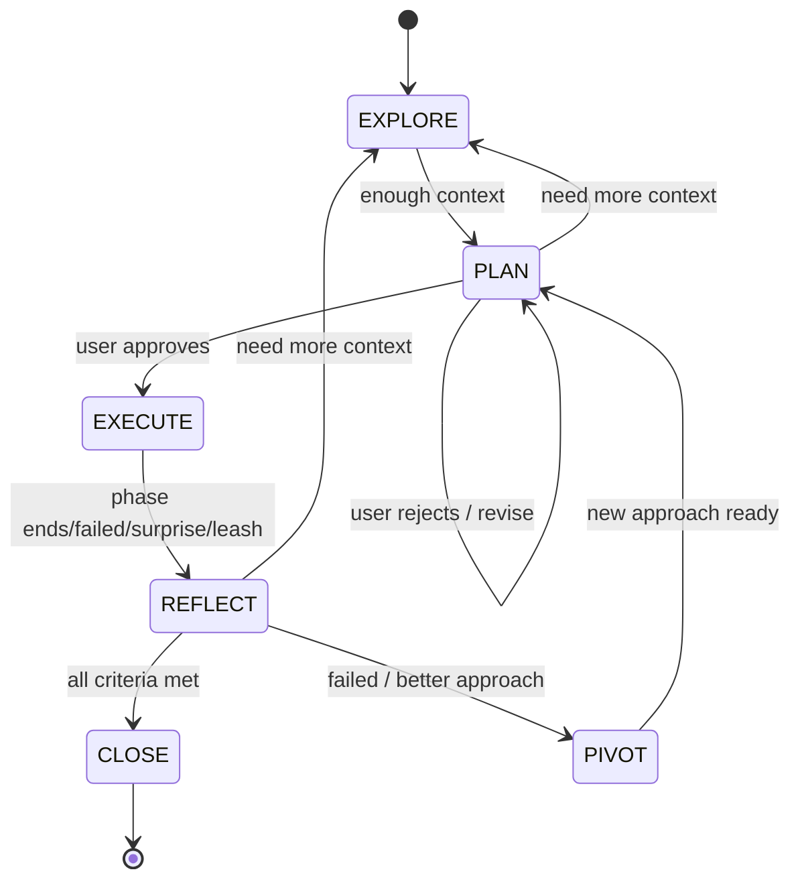

# Iterative Planner

**Core Principle**: Context Window = RAM. Filesystem = Disk.
Write to disk immediately. The context window will rot. The files won't.

**`{plan-dir}`** = `plans/plan_YYYY-MM-DD_XXXXXXXX/` (active plan directory under project root).
**Discovery**: `plans/.current_plan` contains the plan directory name. One active plan at a time.
**Cross-plan context**: `plans/FINDINGS.md` and `plans/DECISIONS.md` persist across plans (merged on close). `plans/LESSONS.md` persists across plans (updated on close, max 200 lines). `plans/INDEX.md` maps topics to plan directories (survives sliding window trim).

## State Machine


```mermaid
stateDiagram-v2
    [*] --> EXPLORE
    EXPLORE --> PLAN : enough context
    PLAN --> EXPLORE : need more context
    PLAN --> PLAN : user rejects / revise
    PLAN --> EXECUTE : user approves
    EXECUTE --> REFLECT : phase ends/failed/surprise/leash
    REFLECT --> CLOSE : all criteria met
    REFLECT --> PIVOT : failed / better approach
    REFLECT --> EXPLORE : need more context
    PIVOT --> PLAN : new approach ready
    CLOSE --> [*]
```

| State | Purpose | Allowed Actions |
|-------|---------|-----------------|
| EXPLORE | Gather context | Read-only on project. Write only to `{plan-dir}`. |
| PLAN | Design approach | Write plan.md. NO code changes. |
| EXECUTE | Implement step-by-step | Edit files, run commands, write code. |
| REFLECT | Evaluate results | Read outputs, run tests, review diffs. Update verification.md, decisions.md. |
| PIVOT | Revise direction | Log pivot in decisions.md. Do NOT write plan.md yet. |
| CLOSE | Finalize | Write summary.md. Audit decision anchors. Merge findings/decisions to consolidated files. Update LESSONS.md (≤200 lines). Compress if >500 lines. |

### Transitions

| From → To | Trigger |
|-----------|---------|
| EXPLORE → PLAN | Sufficient context. ≥3 indexed findings in `findings.md`. |
| PLAN → EXPLORE | Can't state problem, can't list files, or insufficient findings. |
| PLAN → PLAN | User rejects plan. Revise and re-present. |
| PLAN → EXECUTE | User explicitly approves. |
| EXECUTE → REFLECT | Execution phase ends (all steps done, failure, surprise, or leash hit). |
| REFLECT → CLOSE | All criteria verified PASS in `verification.md`, no regressions, no simplification blockers. **User confirms.** |
| REFLECT → PIVOT | Failure or better approach found. |
| REFLECT → EXPLORE | Need more context before pivoting. |
| PIVOT → PLAN | New approach formulated. Decision logged. |

> **Bootstrap shortcuts**: `bootstrap.mjs close` allows closing from any state (EXPLORE→CLOSE, PLAN→CLOSE, EXECUTE→CLOSE, PIVOT→CLOSE). These are administrative exits — the protocol CLOSE steps (summary.md, decision audit, LESSONS.md update) should be completed by the agent before running `close`.

Every transition → log in `state.md`. PIVOT transitions → also log in `decisions.md` (what failed, what learned, why new direction).
At CLOSE → audit decision anchors (`references/decision-anchoring.md`). Merge per-plan findings/decisions to `plans/FINDINGS.md` and `plans/DECISIONS.md`. Update `plans/LESSONS.md` with significant lessons (rewrite to ≤200 lines). Compress consolidated files if >500 lines (see "Consolidated File Management").

### Protocol Tiers

Checks marked *(EXTENDED)* in the per-state rules may be skipped for iteration 1 single-pass plans. All other checks are **CORE** — always enforced. EXTENDED checks add value for multi-iteration plans where anchoring bias, ghost constraints, and prediction drift are real risks.

### Mandatory Re-reads (CRITICAL)

These files are active working memory. Re-read during the conversation, not just at start.

| When | Read | Why |
|------|------|-----|
| Before any EXECUTE step | `state.md`, `plan.md`, `progress.md` | Confirm step, manifest, fix attempts, progress sync |
| Before writing a fix | `decisions.md` | Don't repeat failed approaches. Check 3-strike. |
| Before modifying `DECISION`-commented code | Referenced `decisions.md` entry | Understand why before changing |
| Before PLAN or PIVOT | `decisions.md`, `findings.md`, `findings/*`, `plans/LESSONS.md` | Ground plan in known facts + institutional memory |
| Before any REFLECT | `plan.md` (criteria + verification strategy + assumptions), `progress.md`, `verification.md`, `findings.md`, `checkpoints/*`, `decisions.md` | Phase 1 Gate-In: full context before evaluating |
| Every 10 tool calls | `state.md` | Reorient. Right step? Scope crept? |

**>50 messages**: re-read `state.md` + `plan.md` before every response. Files are truth, not memory.

## Bootstrapping

```bash
node <skill-path>/scripts/bootstrap.mjs "goal"              # Create new plan (backward-compatible)
node <skill-path>/scripts/bootstrap.mjs new "goal"           # Create new plan
node <skill-path>/scripts/bootstrap.mjs new --force "goal"   # Close active plan, create new one
node <skill-path>/scripts/bootstrap.mjs resume               # Re-entry summary for new sessions
node <skill-path>/scripts/bootstrap.mjs status               # One-line state summary
node <skill-path>/scripts/bootstrap.mjs close                # Close plan (preserves directory)
node <skill-path>/scripts/bootstrap.mjs list                 # Show all plan directories
node <skill-path>/scripts/validate-plan.mjs                  # Validate active plan compliance
```

`new` refuses if active plan exists — use `resume`, `close`, or `--force`.
`new` ensures `.gitignore` includes `plans/` — prevents plan files from being committed during EXECUTE step commits.
`close` merges per-plan findings/decisions to consolidated files, updates `state.md`, appends to `plans/INDEX.md`, snapshots `plans/LESSONS.md` to the plan directory, and removes the `.current_plan` pointer. The protocol CLOSE state (writing `summary.md`, auditing decision anchors, updating `plans/LESSONS.md`) should be completed by the agent before running `close`.
After bootstrap → **read every file in `{plan-dir}`** (`state.md`, `plan.md`, `decisions.md`, `findings.md`, `progress.md`, `verification.md`) before doing anything else. Then begin EXPLORE. User-provided context → write to `findings.md` first.

## Filesystem Structure

```
plans/
├── .current_plan                  # → active plan directory name
├── FINDINGS.md                    # Consolidated findings across all plans (merged on close)
├── DECISIONS.md                   # Consolidated decisions across all plans (merged on close)
├── LESSONS.md                     # Cross-plan lessons learned (≤200 lines, rewritten on close)
├── INDEX.md                       # Topic→directory mapping (updated on close, survives trim)
└── plan_2026-02-14_a3f1b2c9/      # {plan-dir}
    ├── state.md                   # Current state + transition log
    ├── plan.md                    # Living plan (rewritten each iteration)
    ├── decisions.md               # Append-only decision/pivot log
    ├── findings.md                # Summary + index of findings
    ├── findings/                  # Detailed finding files (subagents write here)
    ├── progress.md                # Done vs remaining
    ├── verification.md            # Verification results per REFLECT cycle
    ├── checkpoints/               # Snapshots before risky changes
    ├── lessons_snapshot.md        # LESSONS.md snapshot at close (auto-created)
    └── summary.md                 # Written at CLOSE
```

Templates: `references/file-formats.md`

### File Lifecycle Matrix

R = read only | W = update (implicit read + write) | R+W = distinct read and write operations | — = do not touch (wrong state if you are).

**Read-before-write rule**: Always read a plan file before writing/overwriting it — even on the first update after bootstrap. Claude Code's Write tool will reject writes to files you haven't read in the current session. This applies to every W and R+W cell below.

| File | EXPLORE | PLAN | EXECUTE | REFLECT | PIVOT | CLOSE |
|------|---------|------|---------|---------|---------|-------|
| state.md | W | W | R+W | W | W | W |
| plan.md | — | W | R+W | R | R | R |
| decisions.md | — | R+W | R | R+W | R+W | R |
| findings.md | W | R | — | R | R+W | R |
| findings/* | W | R | — | R | R+W | R |
| progress.md | — | W | R+W | R+W | W | R |
| verification.md | — | W | W | W | R | R |
| checkpoints/* | — | — | W | R | R | — |
| summary.md | — | — | — | — | — | W |
| plans/FINDINGS.md | R(600) | R(600) | — | — | R(600) | W(merge+compress) |
| plans/DECISIONS.md | R(600) | R(600) | — | — | R(600) | W(merge+compress) |
| plans/LESSONS.md | R | R | — | — | R | W(rewrite≤200) |
| plans/INDEX.md | R | — | — | — | — | W(append via bootstrap) |
| lessons_snapshot.md | — | — | — | — | — | W(auto via bootstrap) |

## Consolidated File Management

`plans/FINDINGS.md` and `plans/DECISIONS.md` grow across plans. Two mechanisms prevent context window bloat:

**Sliding window**: Bootstrap automatically trims consolidated files to the **8 most recent** plan sections on each close. Old plan sections are removed from the consolidated file but remain in their per-plan directories (`plans/plan_*/findings.md`, `plans/plan_*/decisions.md`). This keeps files naturally bounded at ~300-450 lines.

**Read limit**: Always read consolidated files with `limit: 600`. The compressed summary + most recent plan sections fit within this.

**Compression** (rarely needed — sliding window keeps files bounded):
**Threshold**: >500 lines → compressed summary needed. Bootstrap prints `ACTION NEEDED` after merge.

**Compression protocol** (during CLOSE, after merge):
1. Check line count. If ≤500 → no action needed.
2. If >500 and NO `<!-- COMPRESSED-SUMMARY -->` marker exists → create new summary.
3. If >500 and marker already exists → REPLACE content between markers. Never summarize the old summary — read only the raw plan sections below the markers to write the new summary.

**Format** — insert between H1 header and first `## plan_` section:
```markdown
<!-- COMPRESSED-SUMMARY -->
## Summary (compressed)
*Auto-compressed from N lines. Read full content below line 600 if needed.*

### Key Findings
- (≤50 lines of consolidated findings across all plans)

### Key Decisions
- (≤50 lines of consolidated decisions across all plans)
<!-- /COMPRESSED-SUMMARY -->
```

**Rules**:
- Max 100 lines between markers (total, including section headers).
- Focus on: outcomes, active constraints, things NOT to do (failed approaches), anchored decisions.
- Drop: iteration details, timestamps, verbose reasoning — those survive in full content below.
- **Failsafe**: when writing the summary, SKIP everything between `<!-- COMPRESSED-SUMMARY -->` and `<!-- /COMPRESSED-SUMMARY -->` markers. Only summarize the actual plan sections (`## plan_*`). This prevents summaries of summaries.

## Lessons Learned (`plans/LESSONS.md`)

Institutional memory across plans. Unlike FINDINGS.md and DECISIONS.md which grow via append+merge, LESSONS.md is **rewritten** to stay ≤200 lines.

**When to update**: At CLOSE, before running `bootstrap.mjs close`. Read the current file, integrate significant lessons from the plan, and rewrite the entire file — consolidating, deduplicating, and pruning stale entries.

**When to read**: Before PLAN, before PIVOT, and at start of EXPLORE. This is the first thing to check for institutional memory — what patterns work, what doesn't, what to avoid.

**Rules**:
- **Hard cap: 200 lines.** If an update would exceed 200 lines, consolidate aggressively — merge related lessons, drop low-value entries, tighten wording.
- **Rewrite, don't append.** Each update produces a complete, self-contained file. No "added on date X" markers.
- **Focus on**: recurring patterns, failed approaches and why, successful strategies, codebase-specific gotchas, constraints that surprised you.
- **Drop**: one-off findings (those belong in FINDINGS.md), detailed decision reasoning (that's in DECISIONS.md), anything plan-specific that won't help future plans.
- Created automatically by bootstrap on first `new`.

## Per-State Rules

### EXPLORE
- Read `state.md`, `plans/FINDINGS.md` and `plans/DECISIONS.md` (limit: 600 lines), `plans/LESSONS.md`, and `plans/INDEX.md` at start of EXPLORE for cross-plan context. INDEX.md helps locate old findings that have been trimmed from consolidated files.
- Read code, grep, glob, search. One focused question at a time.
- Flush to `findings.md` + `findings/` after every 2 reads. **Read the file first** before each write.
- Include file paths + code path traces (e.g. `auth.rb:23` → `SessionStore#find` → `redis_store.rb:get`).
- DO NOT skip EXPLORE even if you think you know the answer.
- **Minimum depth**: ≥3 indexed findings in `findings.md` before transitioning to PLAN. Findings must cover: (1) problem scope, (2) affected files, (3) existing patterns or constraints. Fewer than 3 → keep exploring.
- **Exploration Confidence** — before transitioning to PLAN, self-assess: problem scope [shallow/adequate/deep], solution space [narrow/open/constrained], risk visibility [blind/partial/clear]. All must be at least "adequate." Any "shallow" or "blind" → keep exploring. Record in the transition log entry in `state.md`. See `references/planning-rigor.md`.
- **Constraint classification** — when documenting constraints in `findings.md`, classify each as:
  - **Hard constraint**: non-negotiable (physics, budget, existing systems, regulations, deadlines).
  - **Soft constraint**: preferences, conventions, team familiarity — negotiable if trade-off is explicit.
  - **Ghost constraint**: past constraints baked into current approach that **no longer apply**. Finding and removing ghost constraints unlocks options nobody thought were available.
  Separate constraints from preferences — be honest about which is which. Can't distinguish them → keep exploring.
- Use **Task subagents** (or `ip-explorer` agents if installed) to parallelize research. Spawn 1-3 explorer agents simultaneously, each assigned a distinct research topic. All subagent output → `{plan-dir}/findings/` files. Never rely on context-only results. **Main agent** updates `findings.md` index after subagents write — subagents don't touch the index. **Naming**: `findings/{topic-slug}.md` (kebab-case, descriptive — e.g. `auth-system.md`, `test-coverage.md`). See "Sub-Agent Architecture" section for dispatch details.
- Use "think hard" / "ultrathink" for complex analysis.
- REFLECT → EXPLORE loops: append to existing findings, don't overwrite. Mark corrections with `[CORRECTED iter-N]`.

### PLAN
- **Gate check**: read `state.md`, `plan.md`, `findings.md`, `findings/*`, `decisions.md`, `progress.md`, `verification.md`, `plans/FINDINGS.md` (limit: 600), `plans/DECISIONS.md` (limit: 600), `plans/LESSONS.md` before writing anything. If not read → read now. No exceptions. If `findings.md` has <3 indexed findings → go back to EXPLORE.
- **Problem Statement first** — before designing steps, write in `plan.md`: (1) what behavior is expected, (2) invariants — what must always be true, (3) edge cases at boundaries. Can't state the problem clearly → go back to EXPLORE.
- Write `plan.md`: problem statement, steps (with risk/dependency annotations), assumptions, failure modes, pre-mortem & falsification signals, success criteria, verification strategy, complexity budget.
- **Decomposition** — when breaking the goal into steps:
  1. Understand the whole problem before splitting into parts. Resist diving into details.
  2. Identify natural boundaries — where do concerns separate?
  3. Minimize dependencies between steps. If two steps must always change together, they're one step.
  4. Start with the hardest or riskiest part (most unknowns). Easier parts rarely invalidate the plan.
  5. When unsure whether to split or merge: split when concerns change for different reasons; merge when split pieces always change together or the split creates more coordination overhead than it removes.
- **Verification Strategy** — for each success criterion, define: what test/check to run, what command to execute, what result means "pass". Write to plan.md `Verification Strategy` section. Plans with no testable criteria → write "N/A — manual review only" (proves you checked). See `references/file-formats.md` for template.
- **Assumptions** — bullet list in plan.md: what you assume, which finding grounds it, which steps depend on it. On surprise discovery during EXECUTE → check this list first. See `references/planning-rigor.md`.
- **Failure Mode Analysis** — for each external dependency or integration point in the plan, answer: what if slow? returns garbage? is down? What's the blast radius? Write to plan.md `Failure Modes` section. No dependencies → write "None identified" (proves you checked).
- **Pre-Mortem & Falsification Signals** — assume the plan failed. 2-3 scenarios with concrete STOP IF triggers. If a trigger fires during EXECUTE → stop and REFLECT. Covers approach validity (distinct from Failure Modes which cover dependencies, and Autonomy Leash which covers step failure). See `references/planning-rigor.md`.
- Write `decisions.md`: log chosen approach + why (mandatory even for first plan). **Trade-off rule** — phrase every decision as **"X at the cost of Y"**. Never recommend without stating what it costs.
- Read then write `verification.md` with initial template (criteria table populated from success criteria, methods from verification strategy, results pending).
- Read then write `state.md` + `progress.md`.
- List **every file** to modify/create. Can't list them → go back to EXPLORE.
- Only recommended approach in plan. Alternatives → `decisions.md`.
- Wait for explicit user approval.

### EXECUTE
- **Pre-Step Checklist** in `state.md`: reset all boxes `[ ]`, then check each `[x]` as completed before starting the step. This is the file-based enforcement of Mandatory Re-reads.
- Iteration 1, first EXECUTE → create `checkpoints/cp-000-iter1.md` (nuclear fallback). "Git State" = commit hash BEFORE changes (the restore point).
- One step at a time. Post-Step Gate after each (see below).
- Checkpoint before risky changes (3+ files, shared modules, destructive ops). Name: `cp-NNN-iterN.md` (e.g. `cp-001-iter2.md`). Increment NNN globally across iterations.
- Commit after each successful step: `[iter-N/step-M] description`.
- If something breaks → STOP. 2 fix attempts max (Autonomy Leash). Each must follow Revert-First.
- **Irreversible operations** (DB migrations, external API calls, service config, non-tracked file deletion): mark step `[IRREVERSIBLE]` in `plan.md` during PLAN. Full procedure: `references/code-hygiene.md`.
- **Surprise discovery** (behavior contradicts findings, unknown dependency, wrong assumption) → check plan.md Assumptions to identify which steps are invalidated. Note in `state.md`, finish or revert current step, transition to REFLECT. Do NOT silently update findings during EXECUTE.
- **Falsification signal fires** (from Pre-Mortem & Falsification Signals in plan.md) → same as surprise discovery. Log which signal fired in `decisions.md`.
- Add `# DECISION D-NNN` comments where needed (`references/decision-anchoring.md`).

#### Post-Step Gate (successful steps only — all 3 before moving on)
1. `plan.md` — mark step `[x]`, advance marker, update complexity budget
2. `progress.md` — move item Remaining → Completed, set next In Progress
3. `state.md` — update step number, append to change manifest

On **failed step**: skip gate. Follow Autonomy Leash (revert-first, 2 attempts max).

### REFLECT

Three phases: Gate-In (gather context), Evaluate (verify + analyze), Gate-Out (decide + present).

#### Phase 1: Gate-In (mandatory reads before any evaluation)
1. Read `plan.md` — success criteria, verification strategy, assumptions, pre-mortem signals.
2. Read `progress.md` — what was completed, what remains, what failed.
3. Read `verification.md` — previous verification results (if iteration 2+).
4. Read `findings.md` + relevant `findings/*` — check if EXECUTE discoveries contradict earlier findings. Note contradictions in `decisions.md`.
5. Read `checkpoints/*` — know rollback options before deciding next transition. Note available restore points in `decisions.md` if transitioning to PIVOT.
6. Read `decisions.md` — check 3-strike patterns, review previous REFLECT cycles (iteration 2+).

All six reads are CORE. Do not evaluate until all are complete.

#### Phase 2: Evaluate
7. **Cross-validate plan vs progress** — every `[x]` in plan.md must be "Completed" in progress.md. Fix drift before proceeding.
8. **Diff review** — review actual code changes (git diff or change manifest in state.md). Check for: debug artifacts, commented-out code, TODO/FIXME/HACK leftovers, unintended modifications to files not in the plan. This checks code quality; verification (next) checks correctness.
9. **Run verification** — execute each check from the Verification Strategy. Read `verification.md`, then record results: criterion, method, command/action, result (PASS/FAIL), evidence (output summary or log reference). See `references/file-formats.md` for template.
10. **Regression check** — re-run any tests that passed before this iteration. If a previously-passing test now fails, record as FAIL in Additional Checks with "regression" noted in Details. Regressions block CLOSE.
11. **Scope drift check** — compare files actually changed (change manifest in state.md) against Files To Modify in plan.md. Unplanned file changes must be justified in `decisions.md` or reverted. Criteria can pass even when implementation has drifted.
12. **Criteria adequacy** — before accepting PASS results, ask: do these criteria test what matters, or what was easy to test? Are there behaviors the criteria don't cover? Record gaps in `verification.md` Not Verified section.
13. **Not-verified list** — in `verification.md`, write what you didn't test and why (no coverage, out of scope, untestable). Absence of evidence is not evidence of absence.
14. **Root cause analysis** (when REFLECT follows failure) — in `decisions.md`, answer: (1) immediate cause, (2) contributing factor (trace back one level), (3) failed defense (which barrier should have caught this and why didn't it), (4) prevention. If the failure is a regression, prepend a Change Analysis question: "what changed since the last passing state?". Multiple roots are normal — don't stop at the first plausible cause. Skip entirely if all criteria PASS on first attempt. See `references/planning-rigor.md`.
15. **Run 6 Simplification Checks** (`references/complexity-control.md`). Compare against **written criteria**, not memory.
16. **Run `validate-plan.mjs`** — protocol compliance check. Address ERRORs before CLOSE. WARNs are advisory.
17. **Prediction accuracy** *(EXTENDED — skip for iteration 1)* — compare plan.md predictions against actual results. Record in `verification.md` Prediction Accuracy table. See `references/planning-rigor.md`.
18. **Convergence score** *(EXTENDED — iteration 2+)* — compute pass rate trend, scope stability, issue decay. Record in `verification.md` Convergence Metrics table. Stalling/diverging scores strengthen case for PIVOT or decomposition — don't wait for iteration 5. See `references/convergence-metrics.md`.
19. **Devil's advocate** *(EXTENDED — skip for iteration 1)* — before routing to CLOSE: name one reason this might still be wrong despite passing verification. If you can't think of one, be more suspicious, not less. Record in `decisions.md`.
20. **Adversarial review** *(EXTENDED — iteration 2+ only)* — spawn an `ip-reviewer` agent (or Task subagent) with `verification.md`, `plan.md` (criteria), and `decisions.md`. Its job: are criteria adequate? what wasn't tested? does evidence support CLOSE? Output → `findings/review-iter-N.md`. Main agent must address each concern in `decisions.md` before routing to CLOSE. See "Sub-Agent Architecture" section for dispatch details.

#### Phase 3: Gate-Out (write + present)
21. Write `verification.md` — complete Verdict section.
22. Write `decisions.md` — what happened, what was learned, root cause (if failure). Include Simplification Checks output.
23. Write `progress.md` — update status of all items.
24. Write `state.md` — log evaluation summary, update transition.

**Present to user before routing:**
1. What was completed (from `progress.md`)
2. What remains (if anything)
3. Verification results summary (PASS/FAIL counts from `verification.md`)
4. Issues found: regressions, scope drift, unverified areas, simplification blockers
5. Recommend: close, pivot, or explore — **wait for user confirmation**

| Condition | → Transition |
|-----------|--------------|
| All criteria verified PASS in `verification.md`, no regressions, no simplification blockers + **user confirms** | → CLOSE |
| Failure understood, new approach clear | → PIVOT |
| Unknowns need investigation, or findings contradicted | → EXPLORE (update findings first) |

### PIVOT
- Read `decisions.md`, `findings.md`, relevant `findings/*`, `plans/LESSONS.md`.
- Read `checkpoints/*` — decide keep vs revert. Default: if unsure, revert to latest checkpoint. See `references/code-hygiene.md` for full decision framework.
- **Ghost constraint scan** *(EXTENDED — skip for iteration 1)* — before designing a new approach, ask: (1) Is the constraint that led to the failed approach still valid? (2) Are we inheriting environmental constraints that are actually preferences? (3) Did an early finding become stale? Log ghost constraints found in `decisions.md`. See `references/planning-rigor.md`.
- If earlier findings proved wrong or incomplete → update `findings.md` + `findings/*` with corrections. Mark corrections: `[CORRECTED iter-N]` + what changed and why. Append, don't delete original text.
- **Momentum check** *(EXTENDED — 2nd PIVOT onward)* — log pivot direction, check for oscillation. Momentum < 0.3 → recommend decomposition. See `references/convergence-metrics.md`.
- Write `decisions.md`: log pivot + mandatory Complexity Assessment (+ pivot direction log if EXTENDED).
- Write `state.md` + `progress.md` (mark failed items, note pivot).
- Present options to user → get approval → transition to PLAN.

## Complexity Control (CRITICAL)

Default response to failure = simplify, not add. See `references/complexity-control.md`.

**Revert-First** — when something breaks: (1) STOP (2) revert? (3) delete? (4) one-liner? (5) none → REFLECT.
**10-Line Rule** — fix needs >10 new lines → it's not a fix → REFLECT.
**3-Strike Rule** — same area breaks 3× → PIVOT with fundamentally different approach. Revert to checkpoint covering the struck area.
**Complexity Budget** — tracked in plan.md: files added 0/3, abstractions 0/2, lines net-zero target.
**Forbidden**: wrapper cascades, config toggles, copy-paste, exception swallowing, type escapes, adapters, "temporary" workarounds.
**Nuclear Option** — iteration 5 + bloat >2× scope → recommend full revert to `cp-000` (or later checkpoint if user agrees). Otherwise proceed with caution. See `references/complexity-control.md`.

## Autonomy Leash (CRITICAL)

When a step fails during EXECUTE:
1. **2 fix attempts max** — each must follow Revert-First + 10-Line Rule.
2. Both fail → **STOP COMPLETELY.** No 3rd fix. No silent alternative. No skipping ahead.
3. Revert uncommitted changes to last clean commit. Codebase must be known-good before presenting.
4. Present: what step should do, what happened, 2 attempts, root cause guess, available checkpoints for rollback.
5. Transition → REFLECT. Log leash hit in `state.md`. Wait for user.

Track attempts in `state.md`. Resets on: user direction, new step, or PIVOT.
**No exceptions.** Unguided fix chains derail projects.

## Code Hygiene (CRITICAL)

Failed code must not survive. Track changes in **change manifest** in `state.md`.
Failed step → revert all uncommitted. PIVOT → explicitly decide keep vs revert.
Codebase must be known-good before any PLAN. See `references/code-hygiene.md`.

## Decision Anchoring (CRITICAL)

Code from failed iterations carries invisible context. Anchor `# DECISION D-NNN`
at point of impact — state what NOT to do and why. Audit at CLOSE.
See `references/decision-anchoring.md`.

## Iteration Limits

Increment on PLAN → EXECUTE. Iteration 0 = EXPLORE-only (pre-plan). First real = iteration 1.
- **Iteration 5**: mandatory decomposition analysis in `decisions.md` — identify 2-3 independent sub-goals that could each be a separate plan, with dependencies between them. See `references/planning-rigor.md`.
- **Iteration 6+**: hard STOP. Present decomposition analysis to user. Break into smaller tasks.

## Recovery from Context Loss

0. If `plans/.current_plan` is missing or corrupted: run `bootstrap.mjs list` to find plan directories, then recreate the pointer: `echo "plan_YYYY-MM-DD_XXXXXXXX" > plans/.current_plan` (substitute actual directory name).
1. `plans/.current_plan` → plan dir name
2. `state.md` → where you are
3. `plan.md` → current plan
4. `decisions.md` → what was tried / failed
5. `progress.md` → done vs remaining
6. `findings.md` + `findings/*` → discovered context
7. `checkpoints/*` → available rollback points and their git hashes
8. `plans/FINDINGS.md` + `plans/DECISIONS.md` → cross-plan context from previous plans
9. `plans/LESSONS.md` → institutional memory (read before planning)
10. `plans/INDEX.md` → topic-to-directory mapping (find old findings by topic when sliding window has trimmed them)
11. Resume from current state. Never start over.

## Git Integration

- EXPLORE/PLAN/REFLECT/PIVOT: no commits.
- EXECUTE: commit per successful step `[iter-N/step-M] desc`. Failed step → revert uncommitted.
- PIVOT: keep successful commits if valid under new plan, or `git checkout <checkpoint-commit> -- .` to revert. No partial state. Log choice in `decisions.md`.
- CLOSE: final commit + tag.

## User Interaction

| State | Behavior |
|-------|----------|
| EXPLORE | Ask focused questions, one at a time. Present findings. |
| PLAN | Present plan. Wait for approval. Re-present if modified. |
| EXECUTE | Report per step. Surface surprises. Ask before deviating. |
| REFLECT | Show completed vs remaining. Present verification results. **Ask** user: close, pivot, or explore. Never auto-close. |
| PIVOT | Reference decision log. Explain pivot. Get approval. |

## Sub-Agent Architecture

The iterative planner supports **optional** specialized sub-agents that parallelize work within each state. If sub-agent definitions (`agents/ip-*.md`) are installed, the orchestrator dispatches them. If not, the monolithic skill works as before — sub-agents are an optimization layer, not a requirement.

**Key constraint**: Sub-agents cannot spawn other sub-agents. The orchestrator (or main agent) is the sole coordinator.

### Agent Definitions

| Agent | File | Role | Tools | Model |
|-------|------|------|-------|-------|
| Orchestrator | `agents/orchestrator.md` | State machine owner, coordinator | Agent, Read, Write, Edit, Bash, Grep, Glob | inherit |
| Explorer | `agents/ip-explorer.md` | Read-only codebase research | Read, Write, Grep, Glob, Bash | sonnet |
| Plan-Writer | `agents/ip-plan-writer.md` | Generates plan.md + verification.md | Read, Write, Edit, Grep, Glob | inherit |
| Executor | `agents/ip-executor.md` | Implements one plan step | Read, Edit, Write, Bash, Grep, Glob | inherit |
| Verifier | `agents/ip-verifier.md` | Runs verification checks | Read, Write, Bash, Grep, Glob | sonnet |
| Reviewer | `agents/ip-reviewer.md` | Adversarial review (iteration ≥ 2) | Read, Write, Grep, Glob, Bash | opus |
| Archivist | `agents/ip-archivist.md` | CLOSE housekeeping | Read, Write, Edit, Grep, Glob, Bash | sonnet |

### File Ownership Model

Each file has a clear owner. Only the owner writes. Others read.

| File | Owner (Writes) | Readers |
|------|----------------|---------|
| `state.md` | Orchestrator | All agents |
| `plan.md` | Plan-writer | Orchestrator, Executor, Verifier |
| `decisions.md` | Orchestrator + Plan-writer | All agents |
| `findings.md` (index) | Orchestrator | Plan-writer, Reviewer |
| `findings/{topic}.md` | Explorer (one per file) | Orchestrator, Plan-writer |
| `findings/review-iter-N.md` | Reviewer | Orchestrator |
| `progress.md` | Orchestrator + Executor | All agents |
| `verification.md` | Plan-writer (template) → Verifier (results) | Orchestrator, Reviewer |
| `checkpoints/*` | Executor | Orchestrator (for PIVOT) |
| `summary.md` | Archivist | — |
| `plans/FINDINGS.md` | Archivist (via bootstrap) | Orchestrator, Plan-writer |
| `plans/DECISIONS.md` | Archivist (via bootstrap) | Plan-writer |
| `plans/LESSONS.md` | Archivist | Explorer, Plan-writer |
| `plans/INDEX.md` | Archivist (via bootstrap) | Orchestrator |

### Dispatch Rules by State

**EXPLORE**: Spawn 1-3 `ip-explorer` agents in parallel, each with a distinct topic. After all complete, orchestrator reads `findings/*` files and updates `findings.md` index. Gate check: ≥3 indexed findings.

**PLAN**: Spawn `ip-plan-writer` with goal + findings summary. Plan-writer reads all `findings/*`, `plans/LESSONS.md`, `plans/DECISIONS.md`. Orchestrator verifies all required sections, presents to user.

**EXECUTE**: Spawn `ip-executor` per step (sequential by default). For truly independent steps, use `isolation: "worktree"` for parallel execution. Orchestrator tracks autonomy leash externally in `state.md`.

**REFLECT**: Spawn `ip-verifier`(s) for parallel verification checks. If iteration ≥ 2, spawn `ip-reviewer` for adversarial review. Orchestrator merges results, presents to user.

**CLOSE**: Spawn `ip-archivist` for summary.md, decision anchor audit, LESSONS.md update. Orchestrator runs `bootstrap.mjs close` after archivist completes.

### Conflict Prevention
1. No concurrent writes to the same file — orchestrator sequences agents accordingly.
2. Explorer agents write to distinct `findings/{topic}.md` files — unique topic slugs.
3. Verifier agents write to distinct sections of `verification.md` — or orchestrator merges outputs.
4. Executor agents in worktree isolation avoid all file conflicts.

## When NOT to Use

Simple single-file changes, obvious solutions, known-root-cause bugs, or "just do it".

## References

- `references/file-formats.md` — templates for all `{plan-dir}` files
- `references/complexity-control.md` — anti-complexity protocol, forbidden patterns
- `references/code-hygiene.md` — change manifest, revert procedures
- `references/decision-anchoring.md` — when/how to anchor decisions in code
- `references/planning-rigor.md` — assumption tracking, pre-mortem, falsification signals, exploration confidence, prediction accuracy
- `references/convergence-metrics.md` — convergence score, momentum tracker, iteration health signals
