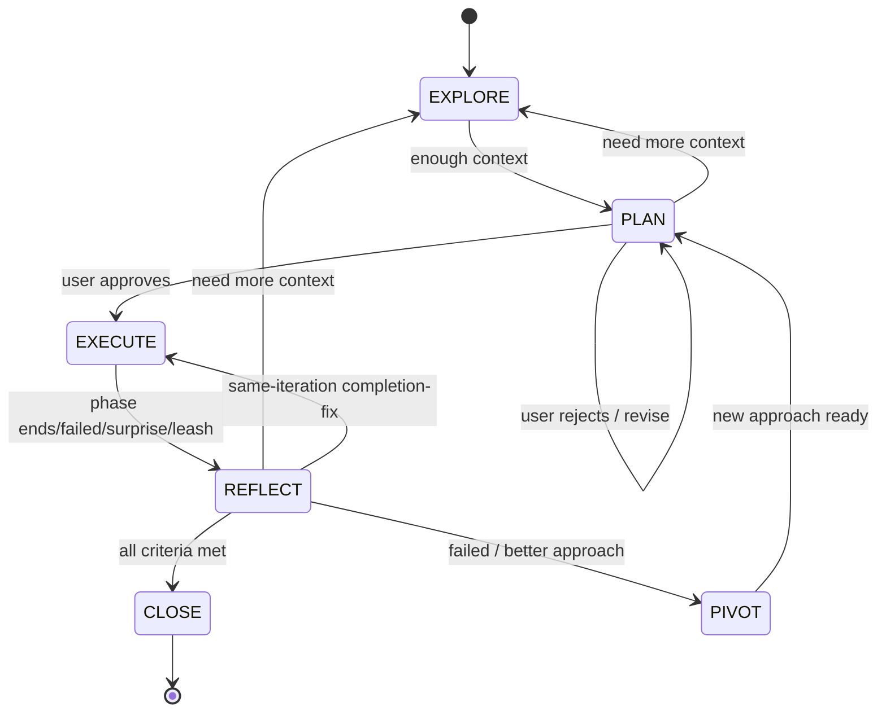

# Iterative Planner

**Core Principle**: Context Window = RAM. Filesystem = Disk.
Write to disk immediately. The context window will rot. The files won't.

**`{plan-dir}`** = `plans/plan-YYYY-MM-DDTHHMMSS-XXXXXXXX/` (active plan directory under project root; UTC timestamp, colon-free, 8-hex tail). Directories created before v2.36.0 use the legacy shape `plans/plan_YYYY-MM-DD_XXXXXXXX/` — never generated again, but **always still read**: every id-recognizing path (pointer, `retire`, anchor scan, `## <plan-id>` sections, `*Plan:*` preamble, sliding-window trim, INDEX date) accepts the union of both grammars.
**Discovery**: `plans/.current_plan` contains the plan directory name. One active plan at a time.
**Cross-plan context**: `plans/FINDINGS.md`, `plans/DECISIONS.md` (merged on close), `plans/LESSONS.md` (rewritten on close), `plans/SYSTEM.md` (system atlas — domain-neutral map of the target system, rewritten on close), `plans/INDEX.md` (topic→directory map, survives sliding-window trim). Caps + R/W rules: File Lifecycle Matrix.

## Orchestrator Role Assumption (READ FIRST)

This skill is driven by a state-machine orchestrator. The authoritative runtime dispatch logic — sub-agent spawning, the six Presentation Contracts, the PLAN compression gate, and the EXECUTE pre-step gate — lives in `agents/ip-orchestrator.md`, NOT in this file. This file is the protocol and state-machine **specification**; `agents/ip-orchestrator.md` is the **procedure** you execute.

On activation, determine your mode:

1. **Already the orchestrator** — if you were launched as `iterative-planner-orchestrator` (via `claude --agent iterative-planner-orchestrator`) OR you have already read `agents/ip-orchestrator.md` and assumed that role earlier in this conversation: do NOT re-read it and do NOT spawn another orchestrator. You ARE the orchestrator — continue with the dispatch logic you already hold. This guard is evaluated FIRST and short-circuits the reload loop that would otherwise arise because `agents/ip-orchestrator.md` declares `skills: [iterative-planner]` (loading it re-loads this skill).
2. **Agent definitions installed** — if `agents/ip-orchestrator.md` is readable and you are NOT already operating as the orchestrator: immediately Read `agents/ip-orchestrator.md` and assume that role for the remainder of this conversation. Resolve `agents/ip-orchestrator.md` against the skill base directory the harness announces on activation (the "Base directory for this skill: ..." line). Treat its Sub-Agent Dispatch Rules, Presentation Contracts, compression gate, and pre-step gate as your operating procedure. Adopt the role **in-thread** — do NOT spawn or launch a separate `iterative-planner-orchestrator` agent. On first activation, FIRST emit the version + credit banner as the load-up line — run `node <skill-path>/scripts/bootstrap.mjs banner` and surface its stdout verbatim — then announce the live mode with one user-visible line — e.g. `[iterative-planner] orchestrator engaged — dispatching specialized sub-agents.` — so the user sees the version and credit and knows sub-agent dispatch is active. Then begin bootstrapping.
3. **Monolithic fallback** — if `agents/ip-orchestrator.md` (and the `agents/ip-*.md` definitions) are NOT installed: run the full protocol yourself in this single thread, driving the state machine from this file's spec — the per-state operative rules come from the `emit-state` router (see below), NOT from inline bodies (the Per-State Rules section is summaries + pointers only) — and FIRST emit the version + credit banner as the load-up line — run `node <skill-path>/scripts/bootstrap.mjs banner` and surface its stdout verbatim — then announce the degraded mode with one user-visible line on activation — e.g. `[iterative-planner] sub-agent definitions not found — running monolithic (single-thread) mode.` — so the user sees the version and credit and silent degradation becomes a visible signal. Use `Task` subagents where this file calls for parallel work (EXPLORE, REFLECT review). The state machine, gates, leash, and Presentation Contracts (`references/file-formats.md`) are identical — you are simply both coordinator and worker. In this mode you also run `node <skill-path>/scripts/emit-state.mjs --state <state>` on entering each of EXPLORE/PLAN/EXECUTE/REFLECT/PIVOT and follow its output as the operative per-state rules (the Per-State Rules section here is now a summary + pointer; the scripts ship with the skill bundle, so the router resolves even without agent definitions installed).

**Idempotency rule**: the trigger for reading `agents/ip-orchestrator.md` is "not yet operating as the orchestrator." Once you have read it once in this conversation, condition 1 holds for every subsequent skill re-trigger — you never read it twice, and there is no spawn, so no reload loop.

### Resolving `<skill-path>`

`<skill-path>` is the **skill's installed base directory** — the one the harness announces to the activating conversation ("Base directory for this skill: ..."). It is the single definition; everything below is a pointer to it.

- **The orchestrator** sees that announcement and holds the absolute path.
- **Sub-agents do not.** So the orchestrator MUST pass it down: every spawn prompt opens with a `SKILL PATH: <absolute-path>` line. A sub-agent resolves `<skill-path>` from that line — nowhere else.
- **Fallback** (line absent, e.g. an out-of-band dispatch): use the installed skill bundle, `~/.claude/skills/iterative-planner/`.
- **It is NEVER a path relative to the target project's root.** A shipped prompt that says `src/scripts/<x>.mjs` is always wrong: a consuming project has no `src/scripts/` and the invocation silently resolves to nothing, disabling whatever check it was supposed to run. This failure is mechanically gated — `scripts/check-agent-wiring.mjs` rules (a) and (d).

## State Machine


```mermaid
stateDiagram-v2
    [*] --> EXPLORE
    EXPLORE --> PLAN : enough context
    PLAN --> EXPLORE : need more context
    PLAN --> PLAN : user rejects / revise
    PLAN --> EXECUTE : user approves
    EXECUTE --> REFLECT : phase ends/failed/surprise/leash
    REFLECT --> CLOSE : all criteria met
    REFLECT --> PIVOT : failed / better approach
    REFLECT --> EXPLORE : need more context
    REFLECT --> EXECUTE : same-iteration completion-fix
    PIVOT --> PLAN : new approach ready
    CLOSE --> [*]
```

| State | Purpose | Allowed Actions |
|-------|---------|-----------------|
| EXPLORE | Gather context | Read-only on project. Write only to `{plan-dir}`. |
| PLAN | Design approach | Write plan.md. NO code changes. |
| EXECUTE | Implement step-by-step | Edit files, run commands, write code. |
| REFLECT | Evaluate results | Read outputs, run tests, review diffs. Update verification.md, decisions.md. |
| PIVOT | Revise direction | Log pivot in decisions.md. Do NOT write plan.md yet. |
| CLOSE | Finalize | Write summary.md. Audit decision anchors. Merge findings/decisions. Rewrite LESSONS.md (trim by importance-then-recency, never drop `[I:5]` — see ip-archivist Step 3) + SYSTEM.md atlas (demote-by-staleness — see ip-archivist Step 5). Compress consolidated files if needed. Caps: Lifecycle Matrix. |

### Transitions

| From → To | Trigger |
|-----------|---------|
| EXPLORE → PLAN | Sufficient context. ≥3 indexed findings in `findings.md`. |
| PLAN → EXPLORE | Can't state problem, can't list files, or insufficient findings. |
| PLAN → PLAN | User rejects plan. Revise and re-present. |
| PLAN → EXECUTE | User explicitly approves. |
| EXECUTE → REFLECT | Execution phase ends (all steps done, failure, surprise, or leash hit). |
| REFLECT → CLOSE | All criteria verified PASS in `verification.md`, no regressions, no simplification blockers. **User confirms.** |
| REFLECT → PIVOT | Failure or better approach found. |
| REFLECT → EXPLORE | Need more context before pivoting. |
| REFLECT → EXECUTE | Completion-fix remediation surfaced during REFLECT: small fixes to finish the SAME iteration's work (not a new approach → not PIVOT; not more context → not EXPLORE). Same iteration only — `iter` does not increment. Not a general re-loop. |
| PIVOT → PLAN | New approach formulated. Decision logged. |

> **Bootstrap shortcuts**: `bootstrap.mjs close` allows closing from any state (EXPLORE→CLOSE, PLAN→CLOSE, EXECUTE→CLOSE, PIVOT→CLOSE). These are administrative exits — the protocol CLOSE steps (summary.md, decision audit, LESSONS.md update) should be completed by the agent before running `close`.

Every transition → log in `state.md`. PIVOT transitions → also log in `decisions.md` (what failed, what learned, why new direction).
At CLOSE → audit decision anchors (`references/decision-anchoring.md`). Merge per-plan findings/decisions to `plans/FINDINGS.md` and `plans/DECISIONS.md`. Update `plans/LESSONS.md` with significant lessons (rewrite to ≤200 lines). Compress consolidated files if >500 lines (see "Consolidated File Management").

### Protocol Tiers

Check tiers: **CORE** (always enforced) | **EXTENDED** (iter ≥ 2 unless a rule's own marker states otherwise; marked *(EXTENDED)* in rules below). EXTENDED checks address anchoring bias, ghost constraints, prediction drift.

### Mandatory Re-reads (CRITICAL)

These files are active working memory. Re-read during the conversation, not just at start.

| When | Read | Why |
|------|------|-----|
| Before any EXECUTE step | `state.md`, `plan.md`, `progress.md` | Confirm step, manifest, fix attempts, progress sync |
| Before writing a fix | `decisions.md` | Don't repeat failed approaches. Check 3-strike. |
| Before modifying `DECISION`-commented code | Referenced `decisions.md` entry | Understand why before changing |
| Before PLAN or PIVOT | `decisions.md`, `findings.md`, `findings/*`, `plans/LESSONS.md`, `plans/SYSTEM.md` | Ground plan in known facts + institutional memory + system atlas |
| Before any REFLECT | `plan.md` (criteria + verification strategy + assumptions), `progress.md`, `verification.md`, `findings.md`, `checkpoints/*`, `decisions.md`, `changelog.md` | Phase 1 Gate-In: full context before evaluating |
| Every 10 tool calls | `state.md` | Reorient. Right step? Scope crept? |

`|messages| > 50` → re-read `state.md` + `plan.md` before every response. Files are truth, not memory.

When `decisions.md` or `changelog.md` contain a `<!-- COMPRESSED-SUMMARY -->` block, the block is your fast-path for D-NNN lookup / changelog overview — the raw entries below the block remain authoritative.

## Bootstrapping

```bash
node <skill-path>/scripts/bootstrap.mjs "goal"              # Create new plan (backward-compatible)
node <skill-path>/scripts/bootstrap.mjs new "goal"           # Create new plan
node <skill-path>/scripts/bootstrap.mjs new --force "goal"   # Close active plan, create new one
node <skill-path>/scripts/bootstrap.mjs resume               # Re-entry summary for new sessions
node <skill-path>/scripts/bootstrap.mjs status               # One-line state summary
node <skill-path>/scripts/bootstrap.mjs close                # Close plan (preserves directory)
node <skill-path>/scripts/bootstrap.mjs list                 # Show all plan directories
node <skill-path>/scripts/bootstrap.mjs banner               # Print version + credit banner (no active plan needed)
node <skill-path>/scripts/bootstrap.mjs retire <plan-id>     # Mark a removed plan's DECISION anchors [STALE], drop its dir
node <skill-path>/scripts/bootstrap.mjs reset-attempts       # Clear active plan's Fix Attempts (unjam stale leash counter)
node <skill-path>/scripts/validate-plan.mjs                  # Validate active plan compliance
```

`new` refuses if active plan exists — use `resume`, `close`, or `--force`.
`new` ensures `.gitignore` includes `plans/` — prevents plan files from being committed during EXECUTE step commits.
`close` merges per-plan findings/decisions to consolidated files, updates `state.md`, appends to `plans/INDEX.md`, snapshots `plans/LESSONS.md` to the plan directory, and removes the `.current_plan` pointer. The protocol CLOSE state (writing `summary.md`, auditing decision anchors, updating `plans/LESSONS.md`) should be completed by the agent before running `close`.
After bootstrap → **read every file in `{plan-dir}`** (`state.md`, `plan.md`, `decisions.md`, `findings.md`, `progress.md`, `verification.md`, `changelog.md`) before doing anything else. Then begin EXPLORE. User-provided context → write to `findings.md` first.

## Filesystem Structure

```
plans/
├── .current_plan                  # → active plan directory name
├── FINDINGS.md                    # Consolidated findings across all plans (merged on close)
├── DECISIONS.md                   # Consolidated decisions across all plans (merged on close)
├── LESSONS.md                     # Cross-plan lessons learned (≤200 lines, rewritten on close)
├── SYSTEM.md                      # System atlas — domain-neutral map of the target system (≤300 lines, rewritten on close)
├── INDEX.md                       # Topic→directory mapping (updated on close, survives trim)
└── plan-2026-02-14T103055-a3f1b2c9/   # {plan-dir} (legacy dirs: plan_2026-02-14_a3f1b2c9/)
    ├── state.md                   # Current state + transition log
    ├── plan.md                    # Living plan (rewritten each iteration)
    ├── decisions.md               # Append-only decision/pivot log
    ├── findings.md                # Summary + index of findings
    ├── findings/                  # Detailed finding files (subagents write here)
    ├── progress.md                # Done vs remaining
    ├── verification.md            # Verification results per REFLECT cycle
    ├── changelog.md               # Per-edit ledger (one line per file edit, append-only)
    ├── checkpoints/               # Snapshots before risky changes
    ├── lessons_snapshot.md        # LESSONS.md snapshot at close (auto-created)
    └── summary.md                 # Written at CLOSE
```

Templates: `references/file-formats.md`

### File Lifecycle Matrix

R = read only | W = update (implicit read + write) | R+W = distinct read and write operations | — = do not touch (wrong state if you are).

**Read-before-write rule**: Always read a plan file before writing/overwriting it — even on the first update after bootstrap. Claude Code's Write tool will reject writes to files you haven't read in the current session. This applies to every W and R+W cell below.

| File | EXPLORE | PLAN | EXECUTE | REFLECT | PIVOT | CLOSE |
|------|---------|------|---------|---------|---------|-------|
| state.md | W | W | R+W | W | W | W |
| plan.md | — | W | R+W | R | R | R |
| decisions.md | — | R+W* | R+W | R+W | R+W | R |
| findings.md | W | R | — | R | R+W | R |
| findings/* | W | R | — | R | R+W | R |
| progress.md | — | W | R+W | R+W | W | R |
| verification.md | — | W | — | W | R | R |
| changelog.md | — | W* | W (append) | R | W (append REVERT) | R |
| checkpoints/* | — | — | W | R | R | — |
| summary.md | — | — | — | — | — | W |
| plans/FINDINGS.md | R(600) | R? | — | — | R(600) | W(merge+compress) |
| plans/DECISIONS.md | R(600) | R(600) | — | — | R(600) | W(merge+compress) |
| plans/LESSONS.md | R | R | — | — | R | W(rewrite≤200) |
| plans/SYSTEM.md | R | R | — | — | R | W(rewrite≤300) |
| plans/INDEX.md | R? | — | — | — | — | W(append via bootstrap) |
| lessons_snapshot.md | — | — | — | — | — | W(auto via bootstrap) |

`R?` = read on demand only, not as part of the eager cross-plan read set. See EXPLORE rules below for the triggers that warrant an INDEX.md read. `plans/FINDINGS.md` at PLAN is `R?` because the plan-writer reads per-plan `findings/*` files (already in PLAN dispatch), not the cross-plan consolidated `plans/FINDINGS.md`, unless explicitly needed for cross-plan context.

`*` Intra-plan compression may insert a `<!-- COMPRESSED-SUMMARY -->` block at PLAN gate-in (decisions.md >300 lines, changelog.md >200 lines). Raw entries preserved verbatim; the W operation is bounded — only the metadata block is written. See `references/file-formats.md` § Intra-plan compression.

## Consolidated File Management

`plans/FINDINGS.md` and `plans/DECISIONS.md` grow across plans. Two mechanisms prevent context window bloat:

**Sliding window**: Bootstrap automatically trims consolidated files to the **4 most recent** plan sections on each close. Old plan sections are removed from the consolidated file but remain in their per-plan directories (`plans/<plan-id>/findings.md`, `plans/<plan-id>/decisions.md`). Use `plans/INDEX.md` to locate trimmed plans by topic. This keeps files naturally bounded at ~150-250 lines.

**Read limit**: Always read consolidated files with `limit: 600`. The compressed summary + most recent plan sections fit within this.

**Compression** (rarely needed — sliding window keeps files bounded):
**Threshold**: >500 lines → compressed summary needed. Bootstrap prints `ACTION NEEDED` after merge.

**Compression protocol** (during CLOSE, after merge):
1. Check line count. If ≤500 → no action needed.
2. If >500 and NO `<!-- COMPRESSED-SUMMARY -->` marker exists → create new summary.
3. If >500 and marker already exists → REPLACE content between markers. Never summarize the old summary — read only the raw plan sections below the markers to write the new summary.

**Format** — insert between H1 header and first `## <plan-id>` section:
```markdown
<!-- COMPRESSED-SUMMARY -->
## Summary (compressed)
*Auto-compressed from N lines. Read full content below line 600 if needed.*

### Key Findings
- (≤50 lines of consolidated findings across all plans)

### Key Decisions
- (≤50 lines of consolidated decisions across all plans)
<!-- /COMPRESSED-SUMMARY -->
```

**Rules**:
- Max 100 lines between markers (total, including section headers).
- Focus on: outcomes, active constraints, things NOT to do (failed approaches), anchored decisions.
- Drop: iteration details, timestamps, verbose reasoning — those survive in full content below.
- **Failsafe**: when writing the summary, SKIP everything between `<!-- COMPRESSED-SUMMARY -->` and `<!-- /COMPRESSED-SUMMARY -->` markers. Only summarize the actual plan sections (`## <plan-id>`). This prevents summaries of summaries.

**Intra-plan compression** (v2.18.0+): per-plan `{plan-dir}/decisions.md` and `{plan-dir}/changelog.md` have their own compression triggered at PLAN gate-in (different thresholds, different shapes). See `references/file-formats.md` § Intra-plan compression (under each file's section).

## Lessons Learned (`plans/LESSONS.md`)

Institutional memory across plans. Unlike FINDINGS.md / DECISIONS.md (append+merge), LESSONS.md is **rewritten** every CLOSE; cap in Lifecycle Matrix.

- **Read**: EXPLORE start, before PLAN, before PIVOT.
- **Update** (CLOSE, before `bootstrap.mjs close`): read current, integrate significant lessons, rewrite. Each lesson carries an inline `[I:N]` importance tag (1-5; untagged = implicit `[I:3]`). If update would exceed cap → consolidate aggressively (merge related, tighten) and trim by **importance then recency**: drop lowest-`[I:N]` entries first, oldest first within a tier, never dropping an `[I:5]`.
- **Rewrite, don't append.** No "added on date X" markers.
- **Keep**: recurring patterns, failed approaches + why, successful strategies, codebase gotchas, surprising constraints.
- **Drop**: one-off findings (→ FINDINGS.md), decision reasoning (→ DECISIONS.md), plan-specific detail.
- Created automatically by bootstrap on first `new`.

## Per-State Rules

> The operative rules for each state are emitted on demand by the router `scripts/emit-state.mjs`, not inlined here. On **entering** a state, run `node <skill-path>/scripts/emit-state.mjs --state <state>` and follow its stdout as the authoritative per-state rules. Full module text lives in `scripts/modules/state-<state>.md`. (This keeps SKILL.md's resident context to the spine; per-state detail is pulled only for the active state. CLOSE has no module — it lives in the State Machine / Transitions table and the ip-archivist.)

### EXPLORE
Gather context: read-only research (code, grep, glob, subagents), flush findings to `findings.md` + `findings/` every 2 reads, classify constraints (hard/soft/ghost), self-assess Exploration Confidence, and reach ≥3 indexed findings covering scope/files/patterns before PLAN.
→ Operative rules: `node <skill-path>/scripts/emit-state.mjs --state explore` (module: `scripts/modules/state-explore.md`).

### PLAN
Design the approach: pass the gate check + compression gate, write Problem Statement first, then `plan.md` with all 11 validator-required sections (Steps, verification strategy, assumptions, failure modes, pre-mortem), log `decisions.md` as "X at the cost of Y", seed `verification.md`/`state.md`/`progress.md`, then emit PC-PLAN and wait for explicit user approval.
→ Operative rules: `node <skill-path>/scripts/emit-state.mjs --state plan` (module: `scripts/modules/state-plan.md`).

### EXECUTE
Implement one step at a time: run the Pre-Step Checklist, create the iteration-1 nuclear checkpoint, checkpoint before risky changes, commit each successful step, append the per-edit changelog line, run the 4-item Post-Step Gate, and on breakage follow the Autonomy Leash (revert-first, 2 attempts max).
→ Operative rules: `node <skill-path>/scripts/emit-state.mjs --state execute` (module: `scripts/modules/state-execute.md`).

### REFLECT
Run the 3-phase gate: Gate-In (7 mandatory reads), Evaluate (cross-validate, diff review, run verification + regression + scope-drift + simplification checks + `validate-plan.mjs`), then Gate-Out (write `verification.md`/`decisions.md`/`progress.md`/`state.md`), and present the 5-item PC-REFLECT contract before routing to CLOSE / PIVOT / EXPLORE / EXECUTE.
→ Operative rules: `node <skill-path>/scripts/emit-state.mjs --state reflect` (module: `scripts/modules/state-reflect.md`).

### PIVOT
Re-route after failure: read `decisions.md`/`findings.md`/`plans/LESSONS.md` + `checkpoints/*`, decide keep-vs-revert, run the ghost-constraint scan, correct stale findings, log the pivot + Complexity Assessment in `decisions.md`, update `state.md`/`progress.md`, then present PC-PIVOT options and get approval before returning to PLAN.
→ Operative rules: `node <skill-path>/scripts/emit-state.mjs --state pivot` (module: `scripts/modules/state-pivot.md`).

## Complexity Control (CRITICAL)

Default response to failure = simplify, not add. See `references/complexity-control.md`.

These guards operationalize three principles already wired into the protocol — name them when applying: **KISS** (Simplification Checks #3 essential/accidental + #4 junior-dev test, `references/complexity-control.md`), **YAGNI** (Complexity Budget + earned-abstraction rule), **DRY** (reuse-before-write — EXECUTE Pre-Step Checklist + `references/code-hygiene.md` § Interface Contracts for Shared Assets).

**Revert-First** — when something breaks: (1) STOP (2) revert? (3) delete? (4) one-liner? (5) none → REFLECT.
**10-Line Rule** — fix needs >10 new lines → it's not a fix → REFLECT.
**3-Strike Rule** — same area breaks 3× → PIVOT with fundamentally different approach. Revert to checkpoint covering the struck area.
**Complexity Budget** — tracked in plan.md: files added 0/3, abstractions 0/2, lines net negative or neutral target.
**Forbidden**: wrapper cascades, config toggles, copy-paste, exception swallowing, type escapes, adapters, "temporary" workarounds.
**Nuclear Option** — iteration 5 + bloat >2× scope → recommend full revert to `cp-000` (or later checkpoint if user agrees). Otherwise proceed with caution. See `references/complexity-control.md`.

## Autonomy Leash (CRITICAL)

When a step fails during EXECUTE:
1. **2 fix attempts max** — each must follow Revert-First + 10-Line Rule.
2. Both fail → **STOP COMPLETELY.** No 3rd fix. No silent alternative. No skipping ahead.
3. Revert uncommitted changes to last clean commit. Codebase must be known-good before presenting.
4. Present: what step should do, what happened, 2 attempts, root cause guess, available checkpoints for rollback.
5. Transition → REFLECT. Log leash hit in `state.md`. Wait for user.

Attempt counter in `state.md`. Resets on: user direction | new step | PIVOT. **Reset mechanically** — run `bootstrap.mjs reset-attempts` (clears the `## Fix Attempts` section to placeholder) rather than hand-editing state.md; a stale counter carried across a PIVOT or new step otherwise HARD-blocks the pre-step gate on the next step (`GATE:FAIL [leash-cap]`).
**No exceptions.** Unguided fix chains derail projects.

**Pre-step gate** (v2.18.0+): `node <skill-path>/scripts/validate-plan.mjs --pre-step` runs in the orchestrator before each ip-executor spawn. Exit code 2 emits one of four `GATE:FAIL` slugs — `[no-plan]`, `[wrong-state]`, `[leash-cap]`, `[iteration-cap]`. `[leash-cap]` mechanically halts EXECUTE when 2 fix attempts are recorded — converting the leash from advisory to enforced. See `agents/ip-orchestrator.md` EXECUTE dispatch for the integration point and the full slug→action mapping.

**Enforcement tiers** — the leash is enforced at two different points, with *intentionally* different thresholds. Do not "align" them:
- **Real-time gate** (`--pre-step`, exit 2): HARD-blocks the **3rd** spawn — fires at `attempts >= 2`. This is the actual cap (2 attempts per step).
- **Retrospective audit** (full `validate-plan.mjs`, `[leash]`): runs over a finished/in-progress plan where **2 recorded attempts is legal** (a step is *allowed* 2). So it WARNs at **3** (a 3rd attempt slipped past the gate) and ERRORs at **4+** (the gate was bypassed). ERRORing at 2 would false-positive on every plan that correctly used both attempts then pivoted.

## Code Hygiene (CRITICAL)

Failed code must not survive. Track changes in **change manifest** in `state.md`.
Failed step → revert all uncommitted. PIVOT → explicitly decide keep vs revert.
Codebase must be known-good before any PLAN. See `references/code-hygiene.md`.

## Decision Anchoring (CRITICAL)

Code from failed iterations carries invisible context. Anchor `# DECISION <plan-id>/D-NNN`
at point of impact — state what NOT to do and why. Audit at CLOSE.
When a plan is deleted or obsoleted while its qualified anchors still live in
source, run `bootstrap.mjs retire <plan-id>` to mark those anchors `[STALE]`
(orphan ERROR → WARN) instead of hand-editing each one — otherwise validate-plan
ERRORs on the orphan and blocks the *current* plan's REFLECT→CLOSE gate.
The plan-id prefix (e.g. `plan-2026-05-07T091743-7556fb98`, or a legacy
`plan_2026-05-07_7556fb98` — both scan) makes the anchor globally
unambiguous and resolvable after `plans/DECISIONS.md` sliding-window trim.
See `references/decision-anchoring.md`.

## Iteration Limits

`iter` counter: increments on PLAN → EXECUTE. `iter=0` = EXPLORE-only (pre-plan).
- `iter = 5`: mandatory decomposition analysis in `decisions.md` (2-3 independent sub-goals + deps). See `references/planning-rigor.md`.
- `iter ≥ 6`: hard STOP. Present decomposition to user. Break into smaller tasks.

## Recovery from Context Loss

0. If `plans/.current_plan` is missing or corrupted: run `bootstrap.mjs list` to find plan directories, then recreate the pointer: `echo "plan-YYYY-MM-DDTHHMMSS-XXXXXXXX" > plans/.current_plan` (substitute the actual directory name — a legacy `plan_YYYY-MM-DD_XXXXXXXX` name is equally valid here).
1. `plans/.current_plan` → plan dir name
2. `state.md` → where you are
3. `plan.md` → current plan
4. `decisions.md` → what was tried / failed
5. `progress.md` → done vs remaining
6. `findings.md` + `findings/*` → discovered context
7. `checkpoints/*` → available rollback points and their git hashes
8. `plans/FINDINGS.md` + `plans/DECISIONS.md` → cross-plan context from previous plans
9. `plans/LESSONS.md` → institutional memory (read before planning)
10. `plans/SYSTEM.md` → system atlas / structural prior (read before PLAN or EXPLORE)
11. `plans/INDEX.md` → grep by topic keyword (each row is one line; do not read the whole file) — topic-to-directory mapping (find old findings by topic when sliding window has trimmed them)
12. Resume from current state. Never start over. When resuming mid-EXECUTE (state.md names a current step), first derive the step's plan-qualified commit tag (Git Integration below: drop the plan-dir name's `THHMMSS` segment) and check `git log --oneline --fixed-strings --grep="plan-YYYY-MM-DD-HASH/iter-N/step-M]"` — keep the closing `]`; a bare `iter-N/step-M` grep false-positives against other plans' commits and `step-1`/`step-10` substrings. If a commit already exists, the step completed before the interruption — run the Post-Step Gate for it instead of re-executing the step.

## Git Integration

- EXPLORE/PLAN/REFLECT/PIVOT: no commits.
- EXECUTE: commit per successful step `[plan-YYYY-MM-DD-HASH/iter-N/step-M] desc`. Failed step → revert uncommitted.
  - **Deriving the tag id**: take the plan-dir name and **drop the `THHMMSS` segment**. `plan-2026-07-14T051317-317362c4` → `[plan-2026-07-14-317362c4/iter-3/step-2] desc`. A **legacy** plan dir (`plan_YYYY-MM-DD_XXXXXXXX`, still executing under this protocol) derives identically, normalizing the `_` separators to `-`: `plan_2026-07-14_79ee0f59` → `[plan-2026-07-14-79ee0f59/iter-3/step-2] desc`.
  - **The changelog `step` field stays bare `iter-N/step-M`** — do not "fix" this apparent inconsistency. That field is sourced from `state.md`, never parsed from a commit subject; nothing in the codebase reads a commit message. Prefixing it would drag in `schema.mjs` / `STEP_RE` and the compression `from`/`to` range bounds for zero benefit.
- PIVOT: keep successful commits if valid under new plan, or `git checkout <checkpoint-commit> -- .` to revert. No partial state. Log choice in `decisions.md`.
- CLOSE: final commit + tag.

## User Interaction

Sub-agents are invisible to the user — only the orchestrator's chat text reaches them. Every state transition that requires user input MUST be preceded by the corresponding **Presentation Contract** in the same assistant turn. Canonical definitions: `references/file-formats.md` "Presentation Contracts" section. The orchestrator inlines each contract's required content list at the point of dispatch in `agents/ip-orchestrator.md`.

| State | Contract | Behavior |
|-------|----------|----------|
| EXPLORE | **PC-EXPLORE** (Findings Digest) | Ask focused questions, one at a time. At handoff, emit findings index + key constraints (HARD/SOFT/GHOST) verbatim, plus exploration confidence and a synthesis paragraph. |
| PLAN | **PC-PLAN** (Plan Presentation) | Render `plan.md` verbatim. Floor (always render): Steps, Success Criteria, Verification Strategy, Failure Modes, Assumptions. Wait for approval. Re-present same contract if modified. |
| EXECUTE | **PC-EXECUTE-STEP** (Per-Step Status) / **PC-EXECUTE-LEASH** (Leash Failure) | After each successful step: 5 fields (step + files + commit + surprises + next-preview). On leash hit: 5 fields (step intent + 2 attempts + root-cause guess + checkpoint registry + prompt). |
| REFLECT | **PC-REFLECT** (Phase-3 Gate-Out 5-Item Block) | Exactly 5 items: completed / remaining / verification table verbatim / issues + reviewer concerns / recommendation + prompt. **Ask** user: close, pivot, explore, or execute. Never auto-close. |
| PIVOT | **PC-PIVOT** (Pivot Options) | Pivot reason + checkpoint registry (verbatim) + ghost constraints + 1-3 candidate directions ("X at the cost of Y") + explicit prompt for direction and keep-vs-revert. |

## Sub-Agent Architecture

The iterative planner supports **optional** specialized sub-agents that parallelize work within each state. If sub-agent definitions (`agents/ip-*.md`) are installed, the orchestrator dispatches them. If not, the monolithic skill works as before — sub-agents are an optimization layer, not a requirement.

**Key constraint**: Sub-agents cannot spawn other sub-agents. The orchestrator (or main agent) is the sole coordinator.

### Agent Definitions

| Agent | File | Role | Tools | Model |
|-------|------|------|-------|-------|
| Orchestrator | `agents/ip-orchestrator.md` | State machine owner, coordinator | Agent, Read, Write, Edit, Bash, Grep, Glob | inherit |
| Explorer | `agents/ip-explorer.md` | Read-only codebase research | Read, Write, Grep, Glob, Bash | sonnet |
| Plan-Writer | `agents/ip-plan-writer.md` | Generates plan.md + verification.md | Read, Write, Edit, Grep, Glob | inherit |
| Executor | `agents/ip-executor.md` | Implements one plan step | Read, Edit, Write, Bash, Grep, Glob | inherit |
| Verifier | `agents/ip-verifier.md` | Runs verification checks | Read, Bash, Grep, Glob | sonnet |
| Reviewer | `agents/ip-reviewer.md` | Adversarial review (iteration ≥ 2 by default; earlier by orchestrator choice, e.g. an iteration-1 attack-before-release pass) | Read, Write, Grep, Glob, Bash | opus |
| Archivist | `agents/ip-archivist.md` | CLOSE housekeeping | Read, Write, Edit, Grep, Glob, Bash | sonnet |

### File Ownership Model

Each file has a clear owner. Only the owner writes. Others read. Co-ownership (multiple writers) is permitted where the writes are disjoint in scope and never concurrent — the orchestrator sequences the writers, and each co-owner's scope is named in the table below. In most co-owned files the orchestrator is the *non-authoring* co-writer: its writes are confined to Post-Step Gate cursor/ledger updates, and the named content owner does all authoring. `decisions.md` inverts this — the Orchestrator and Plan-writer author the entries, while the Executor writes into entries it did not author (back-filling `**Anchor-Refs**:`, recording DRY exceptions) inside its own step's commit rather than at a Post-Step Gate.

| File | Owner (Writes) | Readers |
|------|----------------|---------|
| `state.md` | Orchestrator | All agents |
| `plan.md` | Plan-writer (full rewrite) + Orchestrator (Post-Step Gate: step checkbox, marker, complexity budget) | Executor, Verifier, Reviewer |
| `decisions.md` | Orchestrator + Plan-writer (author entries) + Executor (back-fills `Anchor-Refs` on anchored entries, records DRY exceptions) + Archivist (CLOSE-time Anchor-Refs backfill remediation, ip-archivist.md Step 2) | All agents |
| `findings.md` (index) | Orchestrator | Plan-writer, Reviewer |
| `findings/{topic}.md` | Explorer (one per file) | Orchestrator, Plan-writer |
| `findings/review-iter-N[-passM].md` | Reviewer | Orchestrator |
| `progress.md` | Orchestrator (Post-Step Gate) | All agents |
| `verification.md` | Plan-writer (template) + Orchestrator (merges Verifier's returned results) | Orchestrator, Reviewer |
| `changelog.md` | Executor (append per edit) + Orchestrator (Post-Step Gate: confirm one line per edited file) | Orchestrator (REFLECT Gate-In), Reviewer (REFLECT scan) |
| `checkpoints/*` | Executor | Orchestrator (for PIVOT + EXECUTE leash-hit) |
| `summary.md` | Archivist | — |
| `plans/FINDINGS.md` | Archivist (via bootstrap) | Orchestrator, Plan-writer |
| `plans/DECISIONS.md` | Archivist (via bootstrap) | Orchestrator, Plan-writer |
| `plans/LESSONS.md` | Archivist | Orchestrator, Explorer, Plan-writer |
| `plans/SYSTEM.md` | Archivist | Orchestrator, Plan-writer, Explorer |
| `plans/INDEX.md` | Archivist (via bootstrap) | Orchestrator |

### Dispatch Rules by State

Runtime dispatch — which agents to spawn per state, in what order, with the compression gate (PLAN step 0.5) and pre-step gate (EXECUTE step 1.5) — is owned by `agents/ip-orchestrator.md` § "Sub-Agent Dispatch Rules". **That file is authoritative; do not duplicate its sequencing here.** The per-state *protocol* (gate checks, leash, rigor) is specified above under the Per-State Rules. Monolithic mode (no agents installed) runs the same sequence single-threaded using `Task` subagents for the parallel steps.

### Conflict Prevention
1. No concurrent writes to the same file — orchestrator sequences agents accordingly.
2. Explorer agents write to distinct `findings/{topic}.md` files — unique topic slugs.
3. Verifiers never write `verification.md` — they RETURN structured results; the orchestrator is the sole writer, merging each verifier's returned results into distinct sections (so there are no concurrent writes).
4. Exactly one Executor is spawned at a time (plan steps are sequential), so no two executors are ever concurrent and executor file conflicts cannot arise.

## When NOT to Use

Simple single-file changes, obvious solutions, known-root-cause bugs, or "just do it".

## References

- `references/file-formats.md` — templates for all `{plan-dir}` files
- `references/complexity-control.md` — anti-complexity protocol, forbidden patterns
- `references/code-hygiene.md` — change manifest, revert procedures
- `references/decision-anchoring.md` — when/how to anchor decisions in code
- `references/planning-rigor.md` — assumption tracking, pre-mortem, falsification signals, exploration confidence, prediction accuracy
- `references/root-cause-analysis.md` — structured methods for the failure-time RCA step (5 Whys, fishbone category scan, optional fault tree, Cynefin selector); domain-agnostic core
- `references/convergence-metrics.md` — convergence score, momentum tracker, iteration health signals
- `references/blast-radius.md` — per-edit blast-radius signals + scoring (used by `scripts/blast-radius.mjs`, written to `changelog.md`)
- `references/python-software.md` — domain caveats for Python/software-engineering tasks (consult only for Python/software work; not part of the domain-neutral core)
